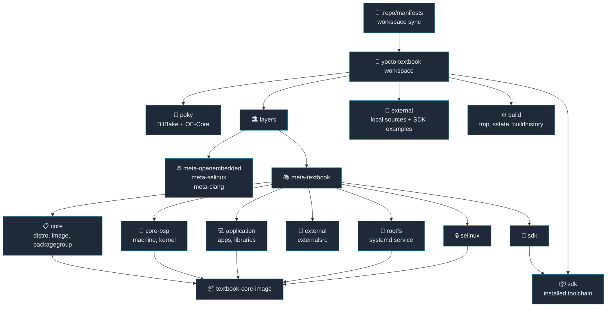

# Yocto Textbook SDK Guide

이 문서는 전체 가이드의 요약과 목차다.
자세한 설명, code example, debugging command, commit 분석은 각 chapter에 나누어 정리했다.

## Guide Overview

이 프로젝트는 Yocto로 QEMU ARM64 기반 `textbook-core-image`를 만들고, 같은 metadata에서 SDK까지 생성하는 학습용 workspace다.
Image에 포함되는 application/kernel module 개발과 SDK를 사용하는 out-of-tree 개발 방식을 함께 다룬다.

기본 command:

```sh
source envsetup.sh
bitbake textbook-core-image
bitbake linux-textbook -c deploy
install_sdk
runqemu textbook-core-image nographic slirp
```

## Workspace Layout

```text
.
├── envsetup.sh
├── .repo
│   └── manifests
├── poky
├── layers
│   ├── meta-openembedded
│   ├── meta-selinux
│   ├── meta-clang
│   └── meta-textbook
├── external
├── build
├── sdk
└── document
    └── topics
```

구성의 중심은 `layers/meta-textbook`이다.
이 layer 안에서 BSP, distro, image, application, external source, rootfs, SELinux, SDK를 chapter 단위로 나누어 설명한다.



## Chapter Format

각 chapter는 다음 순서로 읽도록 구성했다.

- When to use this chapter
- What to add in Yocto
- Where this project implements it
- Key takeaway
- Related commit

## Learning Path

| chapter | topic | what this part explains |
| --- | --- | --- |
| [00](topics/00-yocto-build-pipeline.md) | Yocto workspace structure, metadata file types, build pipeline | Yocto가 source를 직접 build하는 script 모음이 아니라, metadata를 parse해 task graph, package, rootfs, image로 이어지는 pipeline을 만든다는 큰 그림을 잡는다. |
| [01](topics/01-workspace-envsetup.md) | workspace와 environment entrypoint | 사용자가 어디서 시작해야 하는지 고정한다. `envsetup.sh`가 workspace root, build directory, `oe-init-build-env` 진입을 한 command 흐름으로 묶는 역할을 설명한다. |
| [02](topics/02-build-template.md) | build template과 default configuration | 새 build directory가 만들어질 때 어떤 `local.conf`, `bblayers.conf`가 들어가는지 정한다. mirror, sstate, buildhistory 같은 build policy가 왜 source code만큼 중요한지 설명한다. |
| [03](topics/03-bsp-machine-kernel.md) | BSP, Machine, Kernel Provider | target hardware/QEMU machine을 정의하고, 그 target에서 어떤 kernel recipe가 `virtual/kernel` provider가 되는지 연결한다. machine config와 kernel config fragment의 역할을 함께 본다. |
| [04](topics/04-image-packagegroup.md) | Image와 Packagegroup | rootfs에 무엇을 넣을지와 image artifact를 어떤 형태로 만들지를 분리해서 설명한다. image recipe는 정책, packagegroup은 설치 package set을 관리한다는 구조를 잡는다. |
| [05](topics/05-distro-systemd.md) | Distro와 systemd 전환 | machine이 hardware 선택이라면 distro는 product policy 선택이라는 관점을 다룬다. systemd 전환, `DISTRO_FEATURES`, virtual runtime provider가 rootfs 동작에 미치는 영향을 설명한다. |
| [06](topics/06-external-sources.md) | external source 개발 구조 | remote source를 fetch하는 reproducible workflow와 local working copy를 바로 build하는 `externalsrc` workflow의 차이를 설명한다. 빠른 개발과 release 재현성 사이의 경계를 다룬다. |
| [07](topics/07-kernel-module.md) | kernel module을 image에 포함하기 | out-of-tree kernel module을 현재 kernel과 맞춰 build하고, `kernel-module-*` package로 image에 포함하며, boot 시 자동 load되게 만드는 흐름을 설명한다. |
| [08](topics/08-makefile-application.md) | Makefile 기반 application과 library | Yocto가 Makefile project를 자동으로 해석하지 않는다는 점을 전제로, `oe_runmake`, `do_install`, header/shared object/pkg-config install을 recipe에 명시하는 방법을 설명한다. |
| [09](topics/09-cmake-application.md) | CMake 기반 application과 library | `inherit cmake`가 configure/compile/install task를 어떻게 대신 제공하는지 설명한다. Makefile 예제와 비교해 Yocto class를 쓰는 이점을 보여준다. |
| [10](topics/10-thirdparty-metaoe.md) | Third-party package와 meta-oe 연동 | 직접 packaging하는 open source utility와 meta-openembedded에서 가져오는 package를 구분한다. third-party layer가 license, source URI, packagegroup 확장을 관리하는 방식을 설명한다. |
| [11](topics/11-selinux.md) | SELinux 통합 | SELinux가 package 하나로 끝나지 않고 kernel option, distro feature, policy provider, rootfs labeling이 함께 맞아야 하는 기능임을 설명한다. |
| [12](topics/12-rootfs-profile-service.md) | rootfs service 확장 | target이 boot된 뒤 systemd service로 진단 script를 실행하고 결과 file을 남기는 runtime feature를 다룬다. rootfs layer가 운영 기능을 image에 녹이는 방식을 설명한다. |
| [13](topics/13-sdk-workflow.md) | SDK 생성과 SDK 기반 개발 | BitBake build tree 밖에서 target ABI와 맞는 application/module을 build하는 SDK workflow를 설명한다. `populate_sdk`, installer, SDK environment file의 역할을 연결한다. |
| [14](topics/14-devshell-kernel-config.md) | devshell과 kernel configuration | BitBake가 만든 recipe build environment 안으로 들어가 직접 command를 재현하는 방법을 다룬다. kernel `menuconfig`, `savedefconfig`, `diffconfig` 결과를 layer에 저장하는 이유를 설명한다. |
| [15](topics/15-devtool.md) | devtool 기반 recipe 개발 | source 수정, commit, patch 생성, recipe update를 한 workflow로 관리하는 `devtool`의 역할을 설명한다. `externalsrc`와 달리 결과를 layer artifact로 정리하는 데 초점을 둔다. |
| [16](topics/16-yocto-faq-debugging-reference.md) | Yocto FAQ와 debugging reference | build가 실패했을 때 recipe/task/log/variable/layer/appends를 어떤 순서로 확인할지 정리한다. 운영 중 자주 쓰는 debugging command와 buildhistory 확인법을 reference로 묶는다. |

## Commit Reading Guide

`layers/meta-textbook`의 commit 이력은 다음 순서로 읽으면 좋다.

| phase | topic | chapters |
| --- | --- | --- |
| 1 | workspace entrypoint와 template 구성 | [01](topics/01-workspace-envsetup.md), [02](topics/02-build-template.md) |
| 2 | BSP, machine, kernel provider 구성 | [03](topics/03-bsp-machine-kernel.md) |
| 3 | image, packagegroup, distro 구성 | [04](topics/04-image-packagegroup.md), [05](topics/05-distro-systemd.md) |
| 4 | external source와 kernel module 개발 workflow | [06](topics/06-external-sources.md), [07](topics/07-kernel-module.md) |
| 5 | Makefile/CMake application recipe 작성 | [08](topics/08-makefile-application.md), [09](topics/09-cmake-application.md) |
| 6 | third-party, SELinux, rootfs runtime feature 확장 | [10](topics/10-thirdparty-metaoe.md), [11](topics/11-selinux.md), [12](topics/12-rootfs-profile-service.md) |
| 7 | SDK, devshell, devtool, debugging reference | [13](topics/13-sdk-workflow.md), [14](topics/14-devshell-kernel-config.md), [15](topics/15-devtool.md), [16](topics/16-yocto-faq-debugging-reference.md) |

## Commit to Chapter Map

| commit | chapter | document |
| --- | --- | --- |
| `30e7cf1` | workspace 초기 환경 | [01-workspace-envsetup.md](topics/01-workspace-envsetup.md) |
| `8198bff` | template configuration | [02-build-template.md](topics/02-build-template.md) |
| `9b3c03e` | BSP, machine, kernel | [03-bsp-machine-kernel.md](topics/03-bsp-machine-kernel.md) |
| `b255091` | image, packagegroup | [04-image-packagegroup.md](topics/04-image-packagegroup.md) |
| `e99d22f` | core distro | [05-distro-systemd.md](topics/05-distro-systemd.md) |
| `17998dd` | systemd distro | [05-distro-systemd.md](topics/05-distro-systemd.md) |
| `a561318` | external source infrastructure | [06-external-sources.md](topics/06-external-sources.md) |
| `d8df46c` | kernel module recipe | [07-kernel-module.md](topics/07-kernel-module.md) |
| `2bfa3fc` | external kernel module source | [07-kernel-module.md](topics/07-kernel-module.md) |
| `2e832f9` | Makefile app/lib recipes | [08-makefile-application.md](topics/08-makefile-application.md) |
| `32f8693` | external Makefile app/lib | [08-makefile-application.md](topics/08-makefile-application.md) |
| `695ba6a` | unified external layer | [06-external-sources.md](topics/06-external-sources.md) |
| `be7aa91` | external PV generation | [06-external-sources.md](topics/06-external-sources.md) |
| `3f6f2d8` | CMake app/lib recipes | [09-cmake-application.md](topics/09-cmake-application.md) |
| `370321c` | external CMake app/lib | [09-cmake-application.md](topics/09-cmake-application.md) |
| `023abb3` | third-party utility layer | [10-thirdparty-metaoe.md](topics/10-thirdparty-metaoe.md) |
| `bb34ff7` | meta-oe integration | [10-thirdparty-metaoe.md](topics/10-thirdparty-metaoe.md) |
| `9fd2c01` | SELinux layer | [11-selinux.md](topics/11-selinux.md) |
| `a1f4e45` | rootfs profiling service | [12-rootfs-profile-service.md](topics/12-rootfs-profile-service.md) |
| `ae8b16c` | SELinux initial mode variable | [11-selinux.md](topics/11-selinux.md) |
| `5baa5aa` | SDK layer and install helper | [13-sdk-workflow.md](topics/13-sdk-workflow.md) |

## Tool Reference

| tool | use case |
| --- | --- |
| `bitbake <image>` | metadata를 task graph로 풀어 package/rootfs/image를 만들 때 |
| `bitbake <recipe> -c <task>` | `fetch`, `compile`, `install`, `package` 같은 task를 개별 실행할 때 |
| `bitbake <target> -g` | recipe/task dependency graph를 생성해 구조를 확인할 때 |
| `bitbake -c devshell` | recipe의 실제 build environment에서 수동 build와 debugging을 할 때 |
| `bitbake -c menuconfig` | kernel configuration을 대화형 UI로 바꿀 때 |
| `bitbake -c savedefconfig` | kernel configuration을 최소 `defconfig`로 저장할 때 |
| `bitbake -c diffconfig` | `menuconfig` 이후 변경분만 `.cfg` fragment로 뽑을 때 |
| `devtool add` | 새 software를 recipe로 만들 때 |
| `devtool modify` | 기존 recipe source를 workspace로 꺼내 수정할 때 |
| `devtool build/deploy-target` | 수정한 recipe를 빠르게 build하고 live target에 deploy할 때 |
| `devtool finish` | workspace 변경을 정식 layer로 반영할 때 |
| `bitbake-getvar` | variable의 최종값을 빠르게 확인할 때 |
| `bitbake -e` | recipe의 전체 최종 metadata를 dump할 때 |
| `bitbake-layers show-appends` | `.bbappend` 적용 여부를 확인할 때 |
| `buildhistory` | image/package 변화 이력을 확인할 때 |

## Key Takeaways

- Yocto는 단순 build script가 아니라 metadata로 task graph를 만들고 package, rootfs, image, SDK를 생성하는 system이다.
- `meta-textbook`은 layer를 feature별로 나누어, 필요한 기능마다 어떤 metadata를 추가해야 하는지 보여준다.
- `externalsrc`, `devshell`, `devtool`, SDK는 모두 개발 속도를 높이지만 쓰임새가 다르다.
- buildhistory, `bitbake-getvar`, `bitbake -e`, `bitbake-layers`를 알면 Yocto debugging이 훨씬 명확해진다.
