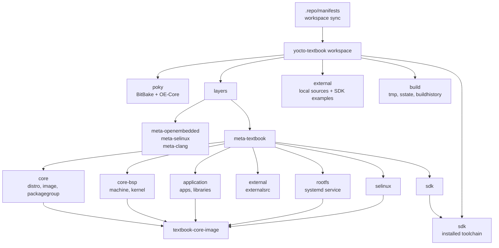

# Yocto Textbook SDK 가이드

이 문서는 전체 가이드의 요약과 목차다. 자세한 설명, code example, debugging command, commit 분석은 각 chapter에 나누어 정리했다.

## 가이드 개요

이 프로젝트는 Yocto로 QEMU ARM64 기반 `textbook-core-image`를 만들고, 같은 metadata에서 SDK까지 생성하는 학습용 workspace다. Image에 포함되는 application/kernel module 개발과 SDK를 사용하는 out-of-tree 개발 방식을 함께 다룬다.

기본 command:

```sh
source envsetup.sh
bitbake textbook-core-image
runqemu textbook-core-image nographic
install_sdk
```

## 전체 구조 요약

```text
yocto-textbook/
  envsetup.sh
  .repo/manifests/
  poky/
  layers/
    meta-openembedded/
    meta-selinux/
    meta-clang/
    meta-textbook/
  external/
  build/
  sdk/
  document/topics/
```

구성의 중심은 `layers/meta-textbook`이다. 이 layer 안에서 BSP, distro, image, application, external source, rootfs, SELinux, SDK를 chapter 단위로 나누어 설명한다.



## Chapter 구성

각 chapter는 다음 순서로 읽도록 구성했다.

- 어떤 상황에서 필요한가
- Yocto에서는 무엇을 추가해야 하는가
- 이 프로젝트에서는 어떤 file로 구현했는가
- 핵심 메시지는 무엇인가
- 관련 commit은 무엇인가

## 추천 학습 순서

0. [Yocto 전체 구조, metadata 파일 타입, build pipeline](topics/00-yocto-build-pipeline.md)
1. [workspace와 environment entrypoint](topics/01-workspace-envsetup.md)
2. [build template과 default configuration](topics/02-build-template.md)
3. [BSP, Machine, Kernel Provider](topics/03-bsp-machine-kernel.md)
4. [Image와 Packagegroup](topics/04-image-packagegroup.md)
5. [Distro와 systemd 전환](topics/05-distro-systemd.md)
6. [external source 개발 구조](topics/06-external-sources.md)
7. [kernel module을 image에 포함하기](topics/07-kernel-module.md)
8. [Makefile 기반 application과 library](topics/08-makefile-application.md)
9. [CMake 기반 application과 library](topics/09-cmake-application.md)
10. [Third-party package와 meta-oe 연동](topics/10-thirdparty-metaoe.md)
11. [SELinux 통합](topics/11-selinux.md)
12. [rootfs service 확장](topics/12-rootfs-profile-service.md)
13. [SDK 생성과 SDK 기반 개발](topics/13-sdk-workflow.md)
14. [devshell과 kernel configuration](topics/14-devshell-kernel-config.md)
15. [devtool 기반 recipe 개발](topics/15-devtool.md)
16. [Yocto FAQ와 debugging reference](topics/16-yocto-faq-debugging-reference.md)

## commit 기반 구성 요약

`layers/meta-textbook`의 commit 이력은 다음 순서로 읽으면 좋다.

| 단계 | 내용 | 관련 chapter |
| --- | --- | --- |
| 1 | workspace entrypoint와 template 구성 | [01](topics/01-workspace-envsetup.md), [02](topics/02-build-template.md) |
| 2 | BSP, machine, kernel provider 구성 | [03](topics/03-bsp-machine-kernel.md) |
| 3 | image, packagegroup, distro 구성 | [04](topics/04-image-packagegroup.md), [05](topics/05-distro-systemd.md) |
| 4 | external source와 kernel module 개발 workflow | [06](topics/06-external-sources.md), [07](topics/07-kernel-module.md) |
| 5 | Makefile/CMake application recipe 작성 | [08](topics/08-makefile-application.md), [09](topics/09-cmake-application.md) |
| 6 | third-party, SELinux, rootfs runtime feature 확장 | [10](topics/10-thirdparty-metaoe.md), [11](topics/11-selinux.md), [12](topics/12-rootfs-profile-service.md) |
| 7 | SDK, devshell, devtool, debugging reference | [13](topics/13-sdk-workflow.md), [14](topics/14-devshell-kernel-config.md), [15](topics/15-devtool.md), [16](topics/16-yocto-faq-debugging-reference.md) |

## commit별 chapter 매핑

| commit | chapter | 관련 문서 |
| --- | --- | --- |
| `30e7cf1` | workspace 초기 환경 | [01-workspace-envsetup.md](topics/01-workspace-envsetup.md) |
| `8198bff` | template configuration | [02-build-template.md](topics/02-build-template.md) |
| `9b3c03e` | BSP, machine, kernel | [03-bsp-machine-kernel.md](topics/03-bsp-machine-kernel.md) |
| `b255091` | image, packagegroup | [04-image-packagegroup.md](topics/04-image-packagegroup.md) |
| `e99d22f` | core distro | [05-distro-systemd.md](topics/05-distro-systemd.md) |
| `17998dd` | systemd distro | [05-distro-systemd.md](topics/05-distro-systemd.md) |
| `a561318` | external source infrastructure | [06-external-sources.md](topics/06-external-sources.md) |
| `d8df46c` | kernel module recipe | [07-kernel-module.md](topics/07-kernel-module.md) |
| `2bfa3fc` | external kernel module source | [07-kernel-module.md](topics/07-kernel-module.md) |
| `2e832f9` | Makefile app/lib recipes | [08-makefile-application.md](topics/08-makefile-application.md) |
| `32f8693` | external Makefile app/lib | [08-makefile-application.md](topics/08-makefile-application.md) |
| `695ba6a` | unified external layer | [06-external-sources.md](topics/06-external-sources.md) |
| `be7aa91` | external PV generation | [06-external-sources.md](topics/06-external-sources.md) |
| `3f6f2d8` | CMake app/lib recipes | [09-cmake-application.md](topics/09-cmake-application.md) |
| `370321c` | external CMake app/lib | [09-cmake-application.md](topics/09-cmake-application.md) |
| `023abb3` | third-party utility layer | [10-thirdparty-metaoe.md](topics/10-thirdparty-metaoe.md) |
| `bb34ff7` | meta-oe integration | [10-thirdparty-metaoe.md](topics/10-thirdparty-metaoe.md) |
| `9fd2c01` | SELinux layer | [11-selinux.md](topics/11-selinux.md) |
| `a1f4e45` | rootfs profiling service | [12-rootfs-profile-service.md](topics/12-rootfs-profile-service.md) |
| `ae8b16c` | SELinux initial mode variable | [11-selinux.md](topics/11-selinux.md) |
| `5baa5aa` | SDK layer and install helper | [13-sdk-workflow.md](topics/13-sdk-workflow.md) |

## Tool 사용 기준

| tool | 사용 상황 |
| --- | --- |
| `bitbake <image>` | metadata를 task graph로 풀어 package/rootfs/image를 만들 때 |
| `bitbake <recipe> -c <task>` | `fetch`, `compile`, `install`, `package` 같은 task를 개별 실행할 때 |
| `bitbake <target> -g` | recipe/task dependency graph를 생성해 구조를 확인할 때 |
| `bitbake -c devshell` | recipe의 실제 build environment에서 수동 build와 debugging을 할 때 |
| `bitbake -c menuconfig` | kernel configuration을 대화형 UI로 바꿀 때 |
| `bitbake -c savedefconfig` | kernel configuration을 최소 `defconfig`로 저장할 때 |
| `bitbake -c diffconfig` | `menuconfig` 변경분만 `.cfg` fragment로 뽑을 때 |
| `devtool add` | 새 software를 recipe로 만들 때 |
| `devtool modify` | 기존 recipe source를 workspace로 꺼내 수정할 때 |
| `devtool build/deploy-target` | 수정한 recipe를 빠르게 build하고 live target에 deploy할 때 |
| `devtool finish` | workspace 변경을 정식 layer로 반영할 때 |
| `bitbake-getvar` | variable의 최종값을 빠르게 확인할 때 |
| `bitbake -e` | recipe의 전체 최종 metadata를 dump할 때 |
| `bitbake-layers show-appends` | `.bbappend` 적용 여부를 확인할 때 |
| `buildhistory` | image/package 변화 이력을 확인할 때 |

## 강조할 메시지

- Yocto는 단순 build script가 아니라 metadata로 task graph를 만들고 package, rootfs, image, SDK를 생성하는 system이다.
- `meta-textbook`은 layer를 feature별로 나누어, 필요한 기능마다 어떤 metadata를 추가해야 하는지 보여준다.
- `externalsrc`, `devshell`, `devtool`, SDK는 모두 개발 속도를 높이지만 쓰임새가 다르다.
- buildhistory, `bitbake-getvar`, `bitbake -e`, `bitbake-layers`를 알면 Yocto debugging이 훨씬 명확해진다.
