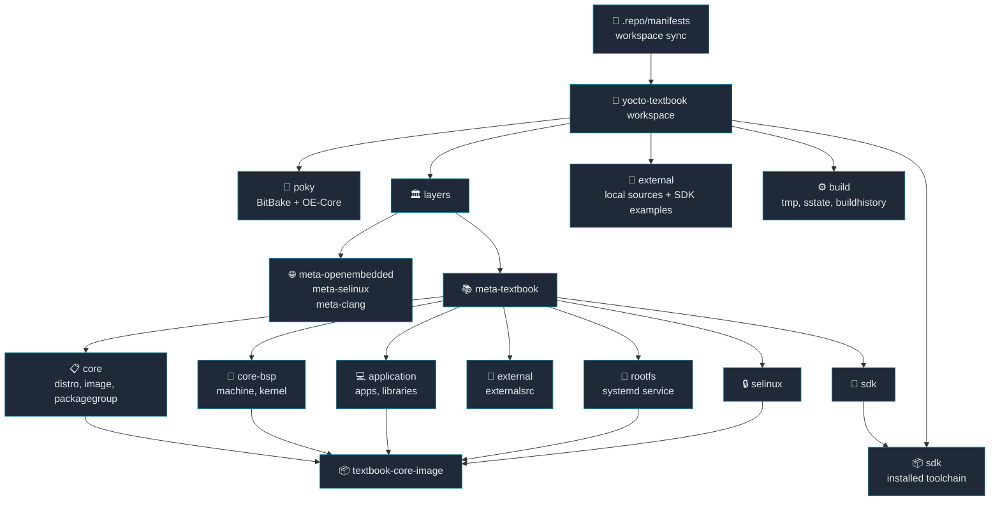

# Yocto Textbook SDK Guide

This document is the overview and table of contents for the Yocto Textbook guide.
Detailed explanations, code examples, debugging commands, and commit-based notes
are split across the chapter files under `topics/`.

## Guide Overview

This project is a learning workspace for building a QEMU ARM64
`textbook-core-image` with Yocto and generating an SDK from the same metadata.
It covers both in-image development, such as applications and kernel modules,
and out-of-tree development through the installed SDK.

Basic workflow:

```sh
source envsetup.sh
bitbake textbook-core-image
bitbake linux-textbook -c deploy
install_sdk
runqemu textbook-core-image nographic slirp
```

## Workspace Layout

```text
.
├── envsetup.sh
├── .repo
│   └── manifests
├── poky
├── layers
│   ├── meta-openembedded
│   ├── meta-selinux
│   ├── meta-clang
│   └── meta-textbook
├── external
├── build
├── sdk
└── document
    └── topics
```

The center of this workspace is `layers/meta-textbook`.
That layer family is used to explain BSP, distro, image, application,
external source, rootfs, SELinux, and SDK topics chapter by chapter.



## Chapter Format

Each chapter follows the same reading pattern.

- When to use the chapter
- What the chapter covers
- What to add in Yocto
- Where this project implements it
- Key takeaway
- Verification commands

## Learning Path

| chapter | topic | what this part explains |
| --- | --- | --- |
| [00](topics/00-yocto-build-pipeline.md) | Yocto workspace structure, metadata file types, build pipeline | Yocto is not a set of shell scripts that simply compile sources. It parses metadata and creates a pipeline from task graph to packages, rootfs, image, and deploy artifacts. |
| [01](topics/01-workspace-envsetup.md) | workspace and environment entrypoint | `envsetup.sh` fixes where users start, how the build directory is entered, and how the same command flow is reused. |
| [02](topics/02-build-template.md) | build template and default configuration | `TEMPLATECONF` controls the default `local.conf` and `bblayers.conf`, including mirror, sstate, and buildhistory policy. |
| [03](topics/03-bsp-machine-kernel.md) | BSP, machine, and kernel provider | Machine configuration selects the target hardware/QEMU model and connects it to the `virtual/kernel` provider. |
| [04](topics/04-image-packagegroup.md) | image and packagegroup | Image recipes define rootfs/image policy, while packagegroups collect packages that should be installed into the image. |
| [05](topics/05-distro-systemd.md) | distro and systemd | Distro configuration selects product policy such as init system, distro features, runtime providers, and filesystem layout. |
| [06](topics/06-external-sources.md) | external source workflow | Standard remote-source recipes are compared with `externalsrc` recipes that build directly from local working copies. |
| [07](topics/07-kernel-module.md) | kernel module in the image | An out-of-tree module is built against the current kernel, packaged as `kernel-module-*`, installed into the image, and autoloaded at boot. |
| [08](topics/08-makefile-application.md) | Makefile applications and libraries | Makefile projects require explicit `oe_runmake`, `do_install`, headers, shared objects, and pkg-config metadata. |
| [09](topics/09-cmake-application.md) | CMake applications and libraries | `inherit cmake` provides the configure, compile, and install flow for CMake projects. |
| [10](topics/10-thirdparty-metaoe.md) | third-party packages and meta-oe | External tools can be packaged directly or pulled from upstream layers such as `meta-openembedded`. |
| [11](topics/11-selinux.md) | SELinux integration | SELinux requires kernel options, distro features, userspace tools, policy, and rootfs labeling to work together. |
| [12](topics/12-rootfs-profile-service.md) | rootfs service extension | A systemd service can make the target collect boot profiling data after startup. |
| [13](topics/13-sdk-workflow.md) | SDK generation and SDK-based development | The SDK provides a target-compatible cross development environment outside the BitBake build tree. |
| [14](topics/14-devshell-kernel-config.md) | devshell and kernel configuration | `devshell`, `menuconfig`, `savedefconfig`, and `diffconfig` are used to reproduce builds and save kernel configuration changes. |
| [15](topics/15-devtool.md) | devtool recipe development | `devtool` manages source modification, commits, patch generation, recipe updates, and layer artifacts. |
| [16](topics/16-yocto-faq-debugging-reference.md) | Yocto FAQ and debugging reference | Common variables, layer inspection, task logs, final metadata, buildhistory, and debugging routines are collected as a reference. |

## Commit Reading Guide

The commit history in `layers/meta-textbook` is easiest to read in the following order.

| phase | topic | chapters |
| --- | --- | --- |
| 1 | workspace entrypoint and template setup | [01](topics/01-workspace-envsetup.md), [02](topics/02-build-template.md) |
| 2 | BSP, machine, and kernel provider setup | [03](topics/03-bsp-machine-kernel.md) |
| 3 | image, packagegroup, and distro setup | [04](topics/04-image-packagegroup.md), [05](topics/05-distro-systemd.md) |
| 4 | external source and kernel module workflow | [06](topics/06-external-sources.md), [07](topics/07-kernel-module.md) |
| 5 | Makefile and CMake application recipes | [08](topics/08-makefile-application.md), [09](topics/09-cmake-application.md) |
| 6 | third-party, SELinux, and rootfs runtime features | [10](topics/10-thirdparty-metaoe.md), [11](topics/11-selinux.md), [12](topics/12-rootfs-profile-service.md) |
| 7 | SDK, devshell, devtool, and debugging reference | [13](topics/13-sdk-workflow.md), [14](topics/14-devshell-kernel-config.md), [15](topics/15-devtool.md), [16](topics/16-yocto-faq-debugging-reference.md) |

## Tool Reference

| tool | use case |
| --- | --- |
| `bitbake <image>` | Build packages, rootfs, image, and deploy artifacts from metadata. |
| `bitbake <recipe> -c <task>` | Run a single task such as `fetch`, `compile`, `install`, or `package`. |
| `bitbake <target> -g` | Generate dependency graphs. |
| `bitbake -c devshell` | Enter the actual recipe build environment for manual reproduction. |
| `bitbake -c menuconfig` | Change kernel configuration through an interactive UI. |
| `bitbake -c savedefconfig` | Save a reduced kernel `defconfig`. |
| `bitbake -c diffconfig` | Extract only the configuration changes after `menuconfig`. |
| `devtool modify` | Extract an existing recipe source tree into a workspace. |
| `devtool finish` | Convert workspace changes into layer patches and metadata. |
| `bitbake-layers show-layers` | Inspect enabled layers. |
| `bitbake-layers show-appends` | Check whether `.bbappend` files are applied. |
| `buildhistory` | Inspect image/package changes across builds. |

## Key Takeaways

- Yocto is a metadata-driven build system, not just a shell-script based source build.
- `meta-textbook` is split by feature so each chapter can show the metadata needed for one capability.
- The fastest way to debug Yocto is to inspect final metadata, task logs, layer state, and buildhistory instead of guessing.
