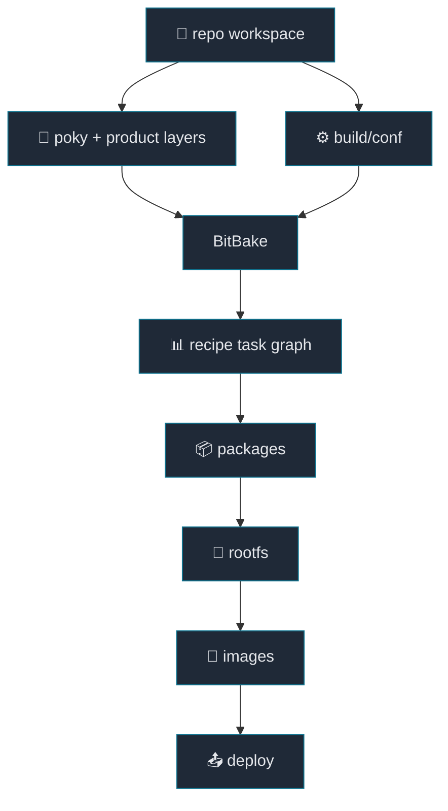

# 00. Yocto Structure and Build Pipeline

[Back to Learning Path](../README.md#learning-path)

## When to Use

Read this chapter first if you need to understand how `recipe`, `layer`,
`machine`, `distro`, and `image` relate to each other. It also explains what
BitBake does during `fetch`, `patch`, `configure`, `compile`, `install`,
`package`, `rootfs`, `image`, and `deploy`.

## What This Chapter Covers

This chapter frames a Yocto build as a metadata-driven pipeline. BitBake parses
metadata, creates a task graph, builds packages, assembles a rootfs, creates
image artifacts, and deploys the final outputs.

## Yocto in One Sentence

Yocto is a metadata-based build system for Embedded Linux products.

The important word is `metadata`. Yocto is not just a collection of shell
scripts that build sources one by one. It describes which source to fetch, which
patches to apply, which options to build with, and which files to place into
packages, the rootfs, and final images.

## Workspace Components

```text
.
├── poky
│   ├── bitbake              # task scheduler/parser
│   ├── meta                 # OE-Core recipes/classes/conf
│   └── meta-poky            # Poky distro metadata
├── layers
│   ├── meta-openembedded    # community recipes
│   ├── meta-selinux         # SELinux recipes/classes
│   ├── meta-clang           # clang/llvm integration
│   └── meta-textbook        # product metadata for this project
└── build
    ├── conf
    │   ├── local.conf       # local build policy
    │   └── bblayers.conf    # enabled layers
    └── tmp                  # workdirs, sysroots, packages, images
```



## Metadata File Types

| file/path | role | project example |
| --- | --- | --- |
| `.conf` | layer, machine, distro, template, and feature configuration | `conf/layer.conf`, `conf/machine/textbook.conf` |
| `.bb` | one recipe for software, an image, or a packagegroup | `linux-textbook.bb`, `textbook-core-image.bb` |
| `.bbappend` | extend an existing recipe from another layer | `linux-textbook.bbappend` |
| `.bbclass` | reusable behavior shared by recipes | `textbook-core-image.bbclass` |
| `recipes-*` | organize recipes by feature area | `recipes-linux`, `recipes-application` |
| `files/` | local files referenced through `file://` | patches, config fragments, service files |

## Build Pipeline

| stage | task | what happens |
| --- | --- | --- |
| source preparation | `do_fetch`, `do_unpack`, `do_patch` | download source, unpack it, and apply patches |
| build preparation | `do_configure` | configure the source for the target |
| build | `do_compile` | compile binaries, libraries, or modules |
| staging | `do_install` | install files into `${D}` |
| packaging | `do_package` | split installed files into packages |
| image creation | `do_rootfs`, `do_image` | install packages into a rootfs and create image artifacts |
| deploy | `do_deploy`, `do_image_complete` | place final outputs under `tmp/deploy` |

## Dependency Types

Yocto dependencies have two common meanings.

| variable | when it is used | example |
| --- | --- | --- |
| `DEPENDS` | build-time dependency needed in the recipe sysroot | headers, static libraries such as `libfoo.a` |
| `RDEPENDS:${PN}` | runtime dependency installed on the target | shared libraries or services needed at runtime, such as `libfoo.so` |

For example, an application that links against a static library needs that
library in the build sysroot, so it belongs in `DEPENDS`. An application that
loads a shared library on the target also needs the runtime package installed in
the rootfs, so that relationship appears through `RDEPENDS`.

## Verification Commands

```sh
source envsetup.sh
bitbake textbook-core-image -g
bitbake hello-makefile-application -c fetch
bitbake hello-makefile-application -c compile -f
bitbake -e hello-makefile-application | grep -E '^(S|B|D|WORKDIR)='
```
