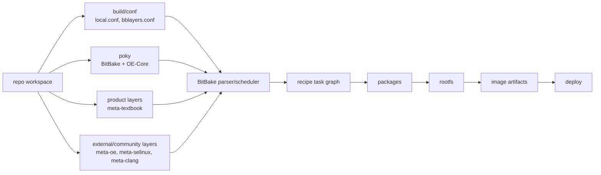
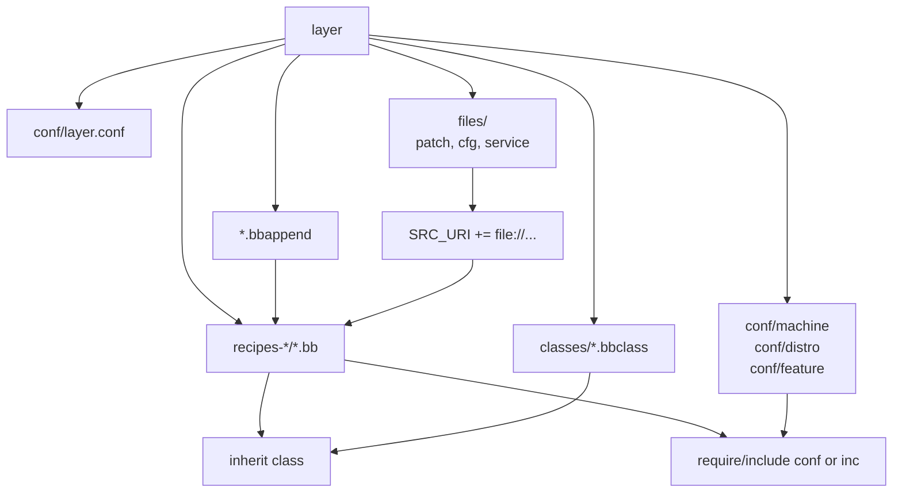

# 00. Yocto 전체 구조와 build pipeline

[학습 순서로 돌아가기](../README.md#추천-학습-순서)

## 필요한 상황

Yocto를 처음 접하는 사람이 `recipe`, `layer`, `machine`, `distro`, `image`의 관계를 이해해야 할 때 이 장을 먼저 읽는다. BitBake가 `fetch`, `patch`, `configure`, `compile`, `install`, `package`, `rootfs`, `image`, `deploy` 단계에서 무엇을 하는지도 함께 정리한다.

이 장은 나머지 topic을 읽기 전에 보는 개론이다.

## Yocto를 한 문장으로 말하면

Yocto는 임베디드 Linux 제품을 만들기 위한 metadata 기반 build system이다.

여기서 핵심은 `metadata`다. Yocto는 source를 하나씩 build하는 shell script 모음이 아니다. 어떤 source를 가져올지, 어떤 patch를 적용할지, 어떤 option으로 build할지, 어떤 file을 package/rootfs/image에 넣을지를 `recipe`와 `layer` metadata로 표현한다.

## 큰 구성 요소

```text
repo workspace
  poky/
    bitbake/                  # task scheduler/parser
    meta/                     # OE-Core 기본 recipe/class/conf
    meta-poky/                # Poky distro metadata
  layers/
    meta-openembedded/        # 추가 community recipes
    meta-selinux/             # SELinux recipes/classes
    meta-clang/               # clang/llvm integration
    meta-textbook/            # 이 프로젝트의 제품 metadata
  build/
    conf/local.conf           # local build policy
    conf/bblayers.conf        # enabled layers
    tmp/                      # workdir, sysroot, packages, images
```



## metadata 계층

| 단위 | 역할 | 이 프로젝트 예 |
| --- | --- | --- |
| `layer` | feature나 ownership 단위로 묶은 metadata | `meta-textbook-core`, `meta-textbook-core-bsp`, `meta-textbook-sdk` |
| `recipe` | software 하나의 build 방법을 정의 | `linux-textbook.bb`, `hello-makefile-application.bb` |
| `class` | recipe들이 공유하는 동작 | `core-image`, `cmake`, `module`, `systemd` |
| `conf` | machine/distro/layer/build configuration | `textbook.conf`, `textbook-systemd-distro.conf` |
| `append` | 기존 recipe에 다른 layer의 설정을 추가 | `linux-textbook.bbappend`, `packagegroup-textbook-core.bbappend` |
| `packagegroup` | image에 설치할 package 목록 | `packagegroup-textbook-core.bb` |
| `image recipe` | rootfs/image 생성 정책 | `textbook-core-image.bb` |

## Metadata 파일 타입

Yocto metadata는 확장자와 위치에 따라 역할이 다르다. 아래 구분을 먼저 잡아두면 recipe를 읽는 속도가 빨라진다.

| 파일/경로 | 역할 | 이 프로젝트 예 |
| --- | --- | --- |
| `.conf` | layer, machine, distro, template, feature configuration | `conf/layer.conf`, `conf/machine/textbook.conf`, `conf/distro/textbook-systemd-distro.conf` |
| `.bb` | software, image, packagegroup 하나의 recipe | `linux-textbook.bb`, `hello-cmake-application.bb`, `textbook-core-image.bb` |
| `.bbappend` | 기존 recipe에 다른 layer의 변경을 추가 | `linux-textbook.bbappend`, `packagegroup-textbook-core.bbappend` |
| `.bbclass` | 여러 recipe가 공유하는 공통 동작을 정의 | `classes/textbook-core-image.bbclass` |
| `classes/` | `.bbclass` file을 두는 경로 | `meta-textbook-core/classes/` |
| `recipes-*` | recipe를 feature별로 정리하는 경로 | `recipes-linux`, `recipes-application`, `recipes-rootfs` |
| `files/` | `file://`로 참조되는 patch, config, service, script를 두는 경로 | `linux/files/qemuarm64.cfg`, `systemd/files/textbook-profile.service` |



### `.conf`

`.conf`는 build policy와 선택지를 정한다.

대표 위치:

```text
build/conf/local.conf
build/conf/bblayers.conf
meta-textbook-core-bsp/conf/machine/textbook.conf
meta-textbook-core/conf/distro/textbook-systemd-distro.conf
meta-textbook-*/conf/layer.conf
```

예:

```bitbake
MACHINE ??= "textbook"
DISTRO ?= "textbook-systemd-distro"
PREFERRED_PROVIDER_virtual/kernel = "linux-textbook"
```

### `.bb`

`.bb`는 하나의 build target을 정의한다. application, library, kernel, kernel module, image, packagegroup 모두 recipe가 될 수 있다.

예:

```bitbake
DESCRIPTION = "This recipe builds an executable"
SRC_URI = "git://github.com/yocto-textbook/hello-cmake-application.git;protocol=https;branch=main"
SRCREV = "${AUTOREV}"
S = "${WORKDIR}/git"

inherit cmake pkgconfig
DEPENDS = "hello-cmake-library"
```

### `.bbappend`

`.bbappend`는 같은 이름의 `.bb` recipe에 추가 configuration을 붙인다. 원본 recipe를 직접 수정하지 않고 다른 layer에서 feature를 추가할 때 사용한다.

예:

```bitbake
RDEPENDS:${PN} += "\
    textbook-profile-service \
"
```

`externalsrc`도 `.bbappend`로 기존 recipe를 local source tree 기반으로 바꾼다.

```bitbake
inherit externalsrc
EXTERNALSRC = "${COREBASE}/../external/hello-cmake-application"
EXTERNALSRC_BUILD = "${WORKDIR}/build"
```

적용 여부 확인:

```sh
bitbake-layers show-appends
bitbake-layers show-appends | grep linux-textbook
```

### `.bbclass`와 `classes/`

`.bbclass`는 여러 recipe가 공유하는 task, variable, helper를 담는다. Recipe에서는 `inherit`로 class를 가져온다.

예:

```bitbake
inherit textbook-core-image
inherit cmake
inherit module
inherit systemd
```

이 프로젝트의 `textbook-core-image.bbclass`는 image recipe의 기본 구조와 rootfs policy를 공통으로 제공한다.

### `require`, `include`, `inherit`

| 문법 | 의미 |
| --- | --- |
| `inherit <class>` | `.bbclass`를 가져와 task/variable 동작을 확장한다 |
| `require <file>` | 다른 metadata 파일을 반드시 포함한다. 없으면 error |
| `include <file>` | 다른 metadata 파일을 포함한다. 없으면 건너뛸 수 있다 |
| `SRC_URI += "file://..."` | recipe 작업에 필요한 local file, patch, config를 추가한다 |

## BitBake가 보는 전체 workflow

```text
source/envsetup
  -> parse metadata
  -> resolve providers/dependencies
  -> run recipe tasks
  -> create packages
  -> assemble rootfs
  -> create image artifacts
  -> deploy outputs
```

command 하나로 보면:

```sh
source envsetup.sh
bitbake textbook-core-image
```

겉으로는 `textbook-core-image` 하나만 build하는 것처럼 보인다. 하지만 BitBake는 image가 의존하는 packagegroup, packagegroup이 의존하는 runtime package, 각 package의 build dependency, kernel, toolchain, native tool까지 task graph로 풀어서 실행한다.

## Recipe task workflow

일반적인 recipe는 다음 task를 거친다.

```text
do_fetch
  -> do_unpack
  -> do_patch
  -> do_configure
  -> do_compile
  -> do_install
  -> do_package
  -> do_package_qa
  -> do_package_write_*
  -> do_populate_sysroot
```

image는 package를 모아서 추가 task를 실행한다.

```text
do_rootfs
  -> do_image
  -> do_image_complete
  -> do_deploy
```



```mermaid
flowchart LR
    Fetch["do_fetch<br/>source download"] --> Unpack["do_unpack<br/>source tree"]
    Unpack --> Patch["do_patch<br/>patch apply"]
    Patch --> Configure["do_configure<br/>build options"]
    Configure --> Compile["do_compile<br/>build binaries"]
    Compile --> Install["do_install<br/>stage into D"]
    Install --> Package["do_package<br/>split packages"]
    Package --> QA["do_package_qa"]
    QA --> WritePkg["do_package_write_*"]
    WritePkg --> Sysroot["do_populate_sysroot"]
    WritePkg --> Rootfs["do_rootfs"]
    Rootfs --> Image["do_image"]
    Image --> Complete["do_image_complete"]
    Complete --> Deploy["do_deploy"]
```

## 각 task가 하는 일

| task | 하는 일 | 설명 |
| --- | --- | --- |
| `do_fetch` | `SRC_URI`의 source를 downloads에 가져온다 | source 확보 |
| `do_unpack` | tarball/git checkout 등을 workdir에 푼다 | build할 source tree 만들기 |
| `do_patch` | `SRC_URI`에 있는 patch를 적용한다 | 프로젝트 변경 반영 |
| `do_configure` | autotools/cmake/kernel config 등을 수행한다 | build option 결정 |
| `do_compile` | 실제 compile을 수행한다 | binary 생성 |
| `do_install` | `${D}` staging directory에 파일을 설치한다 | package에 들어갈 파일 수집 |
| `do_package` | `${D}`의 파일을 package 단위로 나눈다 | runtime/dev/dbg package 분리 |
| `do_package_qa` | packaging 품질 검사를 한다 | 잘못된 path, rpath, dependency 검사 |
| `do_package_write_*` | rpm/ipk/deb package 파일을 만든다 | package feed 생성 |
| `do_populate_sysroot` | 다른 recipe가 쓸 header/library를 sysroot에 넣는다 | build dependency 제공 |
| `do_rootfs` | package를 rootfs에 설치한다 | target filesystem 조립 |
| `do_image` | ext4, tar.bz2 같은 image format을 만든다 | 부팅/배포용 artifact 생성 |
| `do_deploy` | kernel/image/sdk 등 deploy 결과를 배치한다 | 최종 output 정리 |

## 이 프로젝트 recipe로 연결하기

Makefile 앱:

```bitbake
do_compile() {
    oe_runmake -C ${S} O=${B}
}

do_install() {
    install -d ${D}/${bindir}
    install -m 0755 ${B}/hello-makefile-application ${D}/${bindir}
}
```

설명:

- `do_compile`은 source/build directory에서 target binary를 만든다.
- `do_install`은 그 binary를 `${D}/usr/bin`에 설치한다.
- 이후 `do_package`가 `${D}`를 읽어 package로 나눈다.
- image recipe가 그 package를 rootfs에 설치한다.

CMake 앱:

```bitbake
inherit cmake pkgconfig
DEPENDS = "hello-cmake-library"
```

설명:

- `cmake` class가 `do_configure`, `do_compile`, `do_install`의 기본 동작을 제공한다.
- recipe는 source, version, dependency만 명시해도 된다.

kernel module:

```bitbake
inherit module
KERNEL_MODULE_AUTOLOAD += "hello-module"
```

설명:

- `module` class가 현재 kernel build environment에 맞춰 `.ko`를 build한다.
- package 이름은 kernel version과 연결된다.

image:

```bitbake
IMAGE_INSTALL += "packagegroup-textbook-core"
IMAGE_FSTYPES = " tar.bz2 ext4"
```

설명:

- packagegroup이 rootfs에 들어갈 package 목록을 만든다.
- image recipe가 rootfs 크기, filesystem format, locale, user 등을 정한다.

## Dependency의 두 종류

Yocto에서는 build-time dependency와 runtime dependency를 구분한다.

```bitbake
DEPENDS = "hello-cmake-library"
RDEPENDS:${PN} += "textbook-profile-service"
```

- `DEPENDS`: 이 recipe를 build할 때 sysroot에 먼저 있어야 하는 것
- `RDEPENDS`: target rootfs에서 실행할 때 설치되어야 하는 것

예:

- `hello-cmake-application`은 build할 때 `hello-cmake-library` header/library가 필요하므로 `DEPENDS`를 쓴다.
- `packagegroup-textbook-core`는 target에 설치할 package를 모으므로 `RDEPENDS`를 쓴다.

## Sysroot, rootfs, deploy 구분

| 위치 | 의미 |
| --- | --- |
| recipe `${WORKDIR}` | recipe 하나의 workspace |
| `${S}` | unpack/checkout된 source directory |
| `${B}` | build directory |
| `${D}` | install staging directory |
| recipe sysroot | 다른 recipe가 build dependency로 참조할 header/library |
| rootfs | target에 들어갈 최종 filesystem |
| deploy | kernel, image, sdk installer 같은 최종 output 위치 |

## sstate와 buildhistory

Yocto는 task 결과를 sstate cache로 재사용한다.

```bitbake
SSTATE_DIR = "${TOPDIR}/sstate-cache"
SSTATE_MIRRORS = "file://.* file://${HOME}/yocto/sstate-cache/PATH"
```

이 프로젝트는 buildhistory도 켜두었다.

```bitbake
INHERIT += "buildhistory"
BUILDHISTORY_COMMIT = "1"
BUILDHISTORY_DIR = "${TOPDIR}/buildhistory"
```

설명:

- sstate는 “다시 build하지 않기 위한 cache”다.
- buildhistory는 “이번 image에 무엇이 들어갔는지 기록하는 감사 로그”다.

## task를 직접 실행하는 방법

전체 image build:

```sh
bitbake textbook-core-image
```

특정 recipe의 특정 task만 실행:

```sh
bitbake hello-makefile-application -c fetch
bitbake hello-makefile-application -c compile
bitbake hello-makefile-application -c install
bitbake hello-makefile-application -c package
```

강제로 다시 실행:

```sh
bitbake hello-makefile-application -c compile -f
```

clean 후 rebuild:

```sh
bitbake hello-makefile-application -c clean
bitbake hello-makefile-application
```

## task graph를 보는 방법

```sh
bitbake textbook-core-image -g
```

생성되는 대표 파일:

```text
task-depends.dot
pn-buildlist
recipe-depends.dot
```

이 command는 BitBake가 실제로 recipe/task graph를 만든다는 점을 확인할 때 유용하다.

## 핵심 메시지

Yocto를 이해하는 핵심은 “image 하나를 build한다”가 아니라 “metadata가 task graph를 만들고, task가 package를 만들고, package가 rootfs/image가 된다”는 workflow를 이해하는 것이다.

이 구조를 이해하면 뒤에서 나오는 `devshell`, `menuconfig`, `devtool`, SDK도 자연스럽게 이해된다.

- `devshell`: 특정 recipe task 환경 안에 들어간다.
- `menuconfig/diffconfig`: kernel recipe의 configure 결과를 수정하고 fragment로 저장한다.
- `devtool`: workspace에서 recipe source 수정과 patch 생성을 관리한다.
- SDK: 완성된 image/sysroot와 ABI가 맞는 외부 개발 환경을 제공한다.

대표 variable, layer 조작, buildhistory, error debugging, 최종 recipe/variable 확인 방법은 [16. Yocto 사용 FAQ와 debugging reference](16-yocto-faq-debugging-reference.md)에서 따로 정리한다.

## 확인 command

```sh
source envsetup.sh
bitbake textbook-core-image -g
bitbake hello-makefile-application -c fetch
bitbake hello-makefile-application -c compile -f
bitbake -e hello-makefile-application | grep -E '^(S|B|D|WORKDIR)='
```
