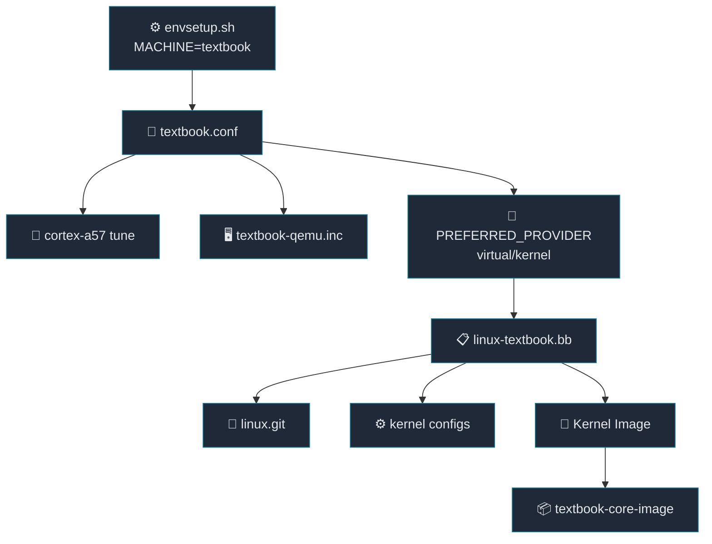

# 03. BSP, Machine, Kernel Provider

[Back to Learning Path](../README.md#learning-path)

Related Commit:

- `9b3c03e meta-textbook-core-bsp: introduce textbook bsp layer and machine configuration`

## When to Use

새 보드나 QEMU target을 만들고, 그 target이 사용할 kernel을 프로젝트 kernel로 고정하고 싶다면 BSP layer와 machine configuration을 추가한다.

## What This Chapter Covers

이 chapter는 target machine과 kernel provider를 연결하는 BSP 구성을 설명한다. machine config가 target 특성을 정하고, `PREFERRED_PROVIDER_virtual/kernel`이 어떤 kernel recipe를 사용할지 결정하는 흐름을 다룬다.

## Required Additions

| 항목 | 역할 |
| --- | --- |
| BSP layer의 `conf/layer.conf` | BitBake에 BSP layer metadata 등록 |
| `conf/machine/<machine>.conf` | target machine 이름과 kernel provider 지정 |
| machine include 파일 | QEMU, tune, serial console 같은 공통 machine 설정 분리 |
| kernel recipe | `virtual/kernel` provider 구현 |
| kernel config fragment | machine별 kernel option 고정 |
| `bblayers.conf.sample` | BSP layer를 기본 layer set에 포함 |
| `envsetup.sh`의 `MACHINE` | build 대상 machine 기본값 지정 |

## Project Implementation

```text
.
└── meta-textbook-core-bsp
    ├── conf
    │   └── machine
    │       ├── textbook.conf
    │       └── include
    │           └── textbook-qemu.inc
    └── recipes-linux
        └── linux
            ├── linux-textbook.bb
            └── files
                ├── qemuarm64.cfg
                └── qemuarm64-ext.cfg
```



Key Configuration:

```bitbake
require conf/machine/include/arm/armv8a/tune-cortexa57.inc
require conf/machine/include/textbook-qemu.inc

KERNEL_IMAGETYPE = "Image"
UBOOT_MACHINE ?= "qemu_arm64_defconfig"
PREFERRED_PROVIDER_virtual/kernel = "linux-textbook"
```

kernel recipe:

```bitbake
inherit kernel
inherit kernel-yocto

SRC_URI = "git://github.com/yocto-textbook/linux.git;protocol=https;branch=main"
SRCREV = "${AUTOREV}"
PROVIDES += "virtual/kernel"
COMPATIBLE_MACHINE = "textbook"
```

## Key Takeaway

Machine은 “무엇을 대상으로 build하는가”를 정의하고, kernel provider는 “그 대상에서 어떤 kernel을 쓸 것인가”를 결정한다. BSP layer는 이 둘을 한곳에 묶는 역할을 한다.

## Verification Commands

```sh
source envsetup.sh
bitbake-getvar MACHINE
bitbake-getvar PREFERRED_PROVIDER_virtual/kernel
bitbake-layers show-layers | grep textbook-core-bsp
```
