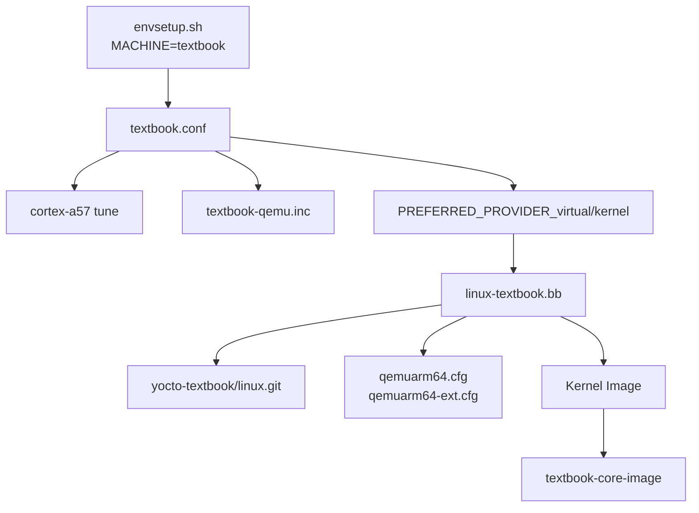

# 03. BSP, Machine, Kernel Provider

[학습 순서로 돌아가기](../README.md#추천-학습-순서)

관련 commit:

- `9b3c03e meta-textbook-core-bsp: introduce textbook bsp layer and machine configuration`

## 필요한 상황

새 보드나 QEMU target을 만들고, 그 target이 사용할 kernel을 프로젝트 kernel로 고정하고 싶다면 BSP layer와 machine configuration을 추가한다.

## 추가하면 되는 것

- BSP layer의 `conf/layer.conf`
- machine 파일: `conf/machine/<machine>.conf`
- 필요한 machine include 파일
- kernel recipe
- kernel config fragment
- `bblayers.conf.sample`에 BSP layer 등록
- `envsetup.sh`에서 `MACHINE=<machine>` configuration

## 이 프로젝트의 구현

파일:

- `meta-textbook-core-bsp/conf/machine/textbook.conf`
- `meta-textbook-core-bsp/conf/machine/include/textbook-qemu.inc`
- `meta-textbook-core-bsp/recipes-linux/linux/linux-textbook.bb`
- `meta-textbook-core-bsp/recipes-linux/linux/files/qemuarm64.cfg`
- `meta-textbook-core-bsp/recipes-linux/linux/files/qemuarm64-ext.cfg`



핵심 configuration:

```bitbake
require conf/machine/include/arm/armv8a/tune-cortexa57.inc
require conf/machine/include/textbook-qemu.inc

KERNEL_IMAGETYPE = "Image"
UBOOT_MACHINE ?= "qemu_arm64_defconfig"
PREFERRED_PROVIDER_virtual/kernel = "linux-textbook"
```

kernel recipe:

```bitbake
inherit kernel
inherit kernel-yocto

SRC_URI = "git://github.com/yocto-textbook/linux.git;protocol=https;branch=main"
SRCREV = "${AUTOREV}"
PROVIDES += "virtual/kernel"
COMPATIBLE_MACHINE = "textbook"
```

## 핵심 메시지

Machine은 “무엇을 대상으로 build하는가”를 정의하고, kernel provider는 “그 대상에서 어떤 kernel을 쓸 것인가”를 결정한다. BSP layer는 이 둘을 한곳에 묶는 역할을 한다.

## 확인 command

```sh
source envsetup.sh
bitbake-getvar MACHINE
bitbake-getvar PREFERRED_PROVIDER_virtual/kernel
bitbake-layers show-layers | grep textbook-core-bsp
```
