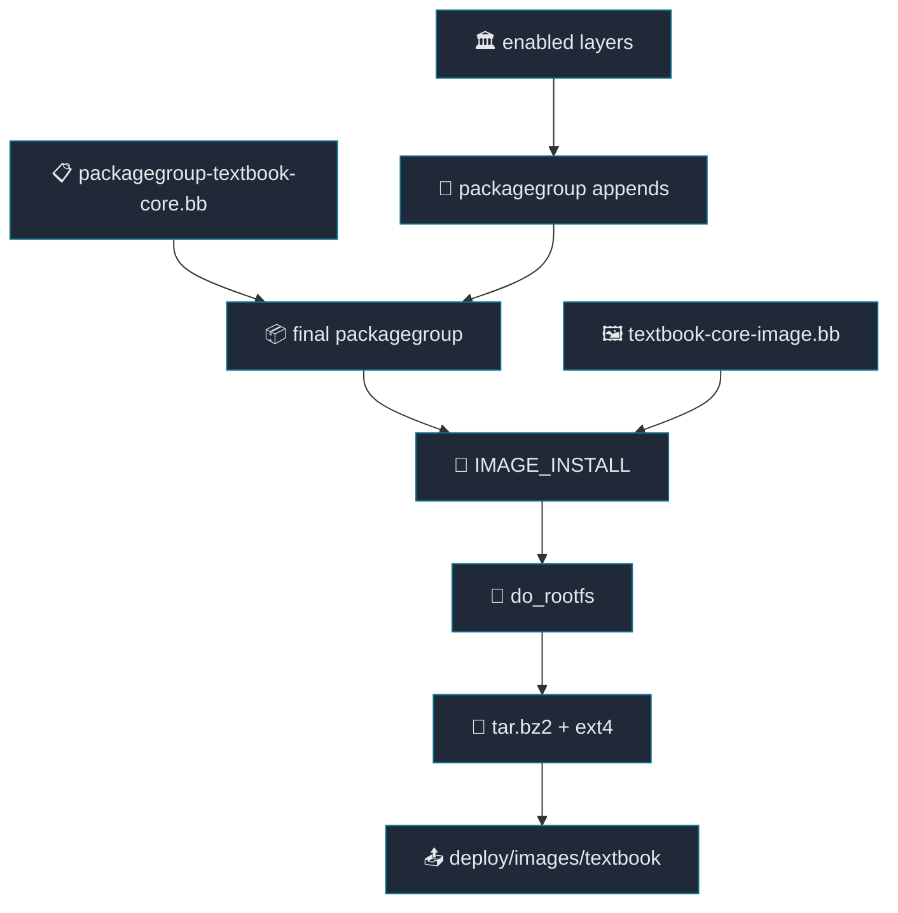

# 04. Image and Packagegroup

[Back to Learning Path](../README.md#learning-path)

Related Commit:

- `b255091 meta-textbook-core: introduce textbook-core-image and core packagegroup`

## When to Use

Use an image recipe and packagegroup when the project needs a bootable rootfs
and a maintainable package list.

## What This Chapter Covers

This chapter separates image policy from package selection. The image recipe
decides rootfs size, image formats, and image-level options. The packagegroup
collects the packages that should be installed into that image.

## Concept

An `image recipe` is the build target that creates the final rootfs and image
artifacts. A `packagegroup` is a recipe that groups runtime packages. Keeping
them separate prevents the image recipe from becoming a long list of unrelated
packages.

| concept | what it controls | project example |
| --- | --- | --- |
| image recipe | rootfs/image policy and artifact formats | `textbook-core-image.bb` |
| packagegroup | package set installed into the rootfs | `packagegroup-textbook-core.bb` |
| packagegroup `.bbappend` | package additions from other layers | application, third-party, SELinux additions |



## Project Implementation

```text
.
└── meta-textbook-core
    ├── classes
    │   └── textbook-core-image.bbclass
    └── recipes-textbook-core
        ├── image/textbook-core-image.bb
        └── packagegroups/packagegroup-textbook-core.bb
```

Image recipe:

```bitbake
inherit textbook-core-image
IMAGE_FSTYPES = " tar.bz2 ext4"
IMAGE_ROOTFS_SIZE = "10240"
IMAGE_INSTALL += "packagegroup-textbook-core"
```

Packagegroup:

```bitbake
inherit packagegroup
RDEPENDS:${PN} = "\
    base-files \
    base-passwd \
    ${VIRTUAL-RUNTIME_init_manager} \
"
```

## Key Takeaway

The image recipe defines the shape and policy of the product image. The
packagegroup defines what goes inside it.

## Verification Commands

```sh
bitbake textbook-core-image
bitbake -e textbook-core-image | grep '^IMAGE_INSTALL='
bitbake -e packagegroup-textbook-core | grep '^RDEPENDS'
```
