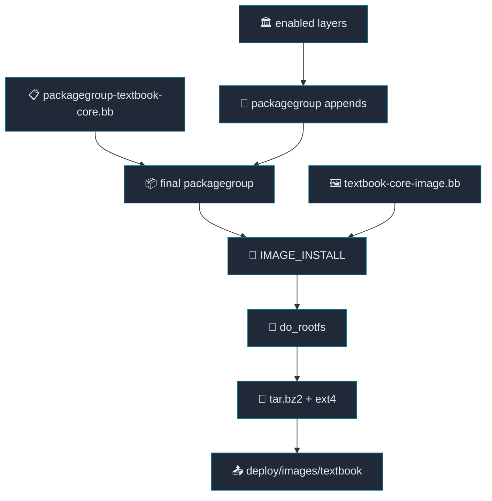

# 04. Image와 Packagegroup

[Back to Learning Path](../README.md#learning-path)

Related Commit:

- `b255091 meta-textbook-core: introduce textbook-core-image and core packagegroup`

## When to Use

부팅 가능한 기본 rootfs를 만들고, image에 들어갈 package 목록을 한곳에서 관리하고 싶다면 image recipe와 packagegroup을 추가한다.

## What This Chapter Covers

이 chapter는 rootfs에 들어갈 package set과 image 생성 정책을 분리해서 관리하는 방법을 설명한다. packagegroup은 설치 대상 package를 모으고, image recipe는 filesystem format, rootfs size, locale 같은 image-level policy를 정한다.

앞 장의 build pipeline 관점에서 보면 image recipe는 `do_rootfs`, `do_image`, `do_image_complete` 단계의 정책을 정하고, packagegroup은 `do_rootfs`가 설치할 package 목록을 제공한다.

## Concept

Yocto에서 `image recipe`는 최종 rootfs/image를 만드는 build target이다. `bitbake textbook-core-image`를 실행했을 때 BitBake가 `IMAGE_INSTALL`, image type, rootfs size 같은 설정을 모아 target filesystem을 만든다.

`packagegroup`은 여러 package를 하나의 묶음으로 설치하기 위한 recipe다. application, service, kernel module, runtime tool이 늘어날수록 `IMAGE_INSTALL`에 package 이름을 계속 직접 추가하면 image recipe가 금방 지저분해진다. 그래서 image recipe에는 `packagegroup-textbook-core` 같은 대표 packagegroup만 넣고, 실제 package 목록은 packagegroup recipe와 각 layer의 `.bbappend`에서 관리한다.

| 개념 | 무엇을 정하는가 | 이 프로젝트 예 |
| --- | --- | --- |
| `image recipe` | 어떤 rootfs/image를 만들지, image format과 rootfs policy를 어떻게 둘지 | `textbook-core-image.bb` |
| `packagegroup` | rootfs에 설치할 package 목록을 feature 단위로 묶음 | `packagegroup-textbook-core.bb` |
| packagegroup `.bbappend` | 다른 layer가 같은 packagegroup에 package를 추가 | application, third-party, SELinux package 추가 |

즉, image recipe는 “제품 image의 틀”이고 packagegroup은 “그 image 안에 들어갈 구성품 목록”이다. packagegroup을 쓰면 나중에 application layer나 SELinux layer가 추가되어도 image recipe를 직접 계속 수정하지 않고 package 목록만 확장할 수 있다.



**Flow:**

| 단계 | Description |
| --- | --- |
| Layers combined into packagegroups | layer별 `.bbappend`가 packagegroup을 확장 |
| Packagegroups merged into `IMAGE_INSTALL` | rootfs에 설치할 package set 결정 |
| Image recipe applies final config | filesystem type, rootfs size, locale 같은 image 정책 적용 |
| `do_rootfs` generates filesystem | package를 설치해 rootfs 생성 |
| Final image artifacts deployed | deploy directory에 image artifact 배치 |

## Required Additions

| 항목 | 역할 |
| --- | --- |
| image class | image 공통 정책 재사용 |
| image recipe | 실제 build target 정의 |
| packagegroup recipe | image에 들어갈 핵심 package 목록 관리 |
| `conf-notes.txt` | build target 안내 |

## Project Implementation

```text
.
└── meta-textbook-core
    ├── classes
    │   └── textbook-core-image.bbclass
    └── recipes-textbook-core
        ├── image
        │   └── textbook-core-image.bb
        └── packagegroups
            └── packagegroup-textbook-core.bb
```

image recipe:

```bitbake
inherit textbook-core-image

IMAGE_FSTYPES = " tar.bz2 ext4"
IMAGE_ROOTFS_SIZE = "10240"
IMAGE_ROOTFS_EXTRA_SPACE = "10240"
IMAGE_INSTALL += "packagegroup-textbook-core"
IMAGE_LINGUAS = "ko-kr en-us"
```

packagegroup:

```bitbake
inherit packagegroup
PACKAGE_ARCH = "${MACHINE_ARCH}"

RDEPENDS:${PN} = "\
    base-files \
    base-passwd \
    ${VIRTUAL-RUNTIME_init_manager} \
    ${VIRTUAL-RUNTIME_dev_manager} \
    ${MACHINE_ESSENTIAL_EXTRA_RDEPENDS} \
"
```

## Key Takeaway

image는 rootfs의 형태와 정책을 정하고, packagegroup은 rootfs 안에 무엇을 넣을지 정한다. 이 둘을 분리하면 이후 layer가 `.bbappend`로 packagegroup만 확장해도 image 내용이 늘어난다.

## Verification Commands

```sh
bitbake textbook-core-image
bitbake -e textbook-core-image | grep '^IMAGE_INSTALL='
bitbake -e packagegroup-textbook-core | grep '^RDEPENDS'
```
