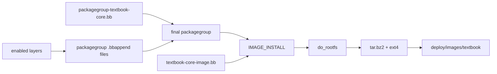

# 04. Image와 Packagegroup

[학습 순서로 돌아가기](../README.md#추천-학습-순서)

관련 commit:

- `b255091 meta-textbook-core: introduce textbook-core-image and core packagegroup`

## 필요한 상황

부팅 가능한 기본 rootfs를 만들고, image에 들어갈 package 목록을 한곳에서 관리하고 싶다면 image recipe와 packagegroup을 추가한다.

앞 장의 build pipeline 관점에서 보면 image recipe는 `do_rootfs`, `do_image`, `do_image_complete` 단계의 정책을 정하고, packagegroup은 `do_rootfs`가 설치할 package 목록을 제공한다.



## 추가하면 되는 것

- image 공통 정책을 담는 image class
- 실제 image recipe
- 핵심 package를 모으는 packagegroup recipe
- `conf-notes.txt`에 build target 안내

## 이 프로젝트의 구현

파일:

- `meta-textbook-core/classes/textbook-core-image.bbclass`
- `meta-textbook-core/recipes-textbook-core/image/textbook-core-image.bb`
- `meta-textbook-core/recipes-textbook-core/packagegroups/packagegroup-textbook-core.bb`

image recipe:

```bitbake
inherit textbook-core-image

IMAGE_FSTYPES = " tar.bz2 ext4"
IMAGE_ROOTFS_SIZE = "10240"
IMAGE_ROOTFS_EXTRA_SPACE = "10240"
IMAGE_INSTALL += "packagegroup-textbook-core"
IMAGE_LINGUAS = "ko-kr en-us"
```

packagegroup:

```bitbake
inherit packagegroup
PACKAGE_ARCH = "${MACHINE_ARCH}"

RDEPENDS:${PN} = "\
    base-files \
    base-passwd \
    ${VIRTUAL-RUNTIME_init_manager} \
    ${VIRTUAL-RUNTIME_dev_manager} \
    ${MACHINE_ESSENTIAL_EXTRA_RDEPENDS} \
"
```

## 핵심 메시지

image는 rootfs의 형태와 정책을 정하고, packagegroup은 rootfs 안에 무엇을 넣을지 정한다. 이 둘을 분리하면 이후 layer가 `.bbappend`로 packagegroup만 확장해도 image 내용이 늘어난다.

## 확인 command

```sh
bitbake textbook-core-image
bitbake -e textbook-core-image | grep '^IMAGE_INSTALL='
bitbake -e packagegroup-textbook-core | grep '^RDEPENDS'
```
