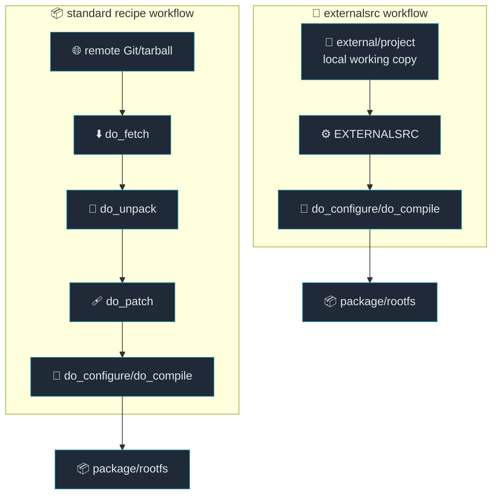
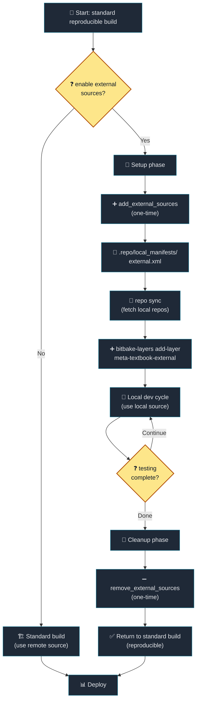

# 06. external source 개발 구조

[Back to Learning Path](../README.md#learning-path)

Related Commit:

- `a561318 build: Add infrastructure for managing external sources and layers`
- `695ba6a build: Consolidate external layers into a single meta-textbook-external layer`
- `be7aa91 external: Align PV generation logic for kernel and kernel module recipes`

## When to Use

remote Git에서 fetch한 source 대신, 개발자가 수정 중인 local working copy를 Yocto가 바로 build하게 하고 싶다면 `externalsrc` layer를 추가한다.

## What This Chapter Covers

이 chapter는 standard recipe workflow와 `externalsrc` workflow의 차이를 설명한다. release/CI에서는 remote source와 고정 `SRCREV`로 재현성을 지키고, 개발 중에는 local working copy를 연결해 빠르게 build/test하는 전환 구조를 다룬다.



**Difference:**

| 방식 | source 위치 | 건너뛰는 단계 | 장점 | 주의점 |
| --- | --- | --- | --- | --- |
| Standard recipe | remote Git/tarball | 없음 | release/CI 재현성 확보 | 개발 반복 속도는 느릴 수 있음 |
| `externalsrc` | local working copy | `fetch`, `unpack`, `patch` 일부 | 수정 중인 source를 바로 build | local 상태와 경로 관리 필요 |

## Required Additions

| 항목 | 역할 |
| --- | --- |
| external source manifest | local 개발 source repo sync |
| external source layer | local source 전환을 한 layer에 격리 |
| 기존 recipe용 `.bbappend` | release recipe는 유지하고 개발용 동작만 덮어쓰기 |
| `inherit externalsrc` | local source tree를 recipe source로 사용 |
| `EXTERNALSRC`, `EXTERNALSRC_BUILD` | source directory와 build directory 분리 |
| Git revision 기반 `PV` | package version이 뒤로 가는 상황 완화 |
| layer 추가/제거 helper | reproducible build와 local dev build 전환 |

## Project Implementation

```text
.
├── .repo
│   └── manifests
│       └── external.xml
└── layers
    └── meta-textbook
        ├── envsetup.sh
        └── meta-textbook-external
            ├── conf
            │   └── layer.conf
            ├── recipes-linux
            │   ├── linux
            │   │   └── linux-textbook.bbappend
            │   └── hello-module
            │       └── hello-module.bbappend
            ├── recipes-application
            │   └── */*.bbappend
            └── recipes-library
                └── */*.bbappend
```

사용 함수:

```sh
add_external_sources
remove_external_sources
```

대표 구현:

```bitbake
inherit externalsrc
EXTERNALSRC = "${COREBASE}/../external/hello-makefile-application"
EXTERNALSRC_BUILD = "${WORKDIR}/build"

SRCREV = "${AUTOREV}"
EXTERNALSRC_GIT_REV := "${@__import__('subprocess').check_output(['git', '-C', d.getVar('EXTERNALSRC'), 'rev-parse', '--short=10', 'HEAD'], text=True).strip()}"
PV = "${HELLO_MAKEFILE_APPLICATION_VERSION}+git0+${EXTERNALSRC_GIT_REV}"
```

Kernel에 `externalsrc`를 적용할 때는 config fragment를 수동으로 merge한다.

```bitbake
do_configure:append() {
    ${S}/scripts/kconfig/merge_config.sh -m -O ${B} \
        ${B}/.config ${KERNEL_CONFIG_FRAGMENTS}
    oe_runmake -C ${S} O=${B} olddefconfig
}
```

## external source 사용 시 주의할 점

`externalsrc`는 개발 속도를 높여주지만, 일반 recipe의 `fetch/unpack/patch` workflow를 일부 건너뛰기 때문에 몇 가지 주의점이 생긴다.


### Source & Reproducibility

| 문제 | 원인 | 대응 |
| --- | --- | --- |
| 재현성이 낮아진다 | local working copy 상태가 build 입력이 됨 | release/CI build는 고정 `SRCREV`와 remote source recipe 사용 |
| uncommitted 변경 추적이 어렵다 | `PV`는 Git `HEAD` 기준이라 working tree dirty 상태 미반영 | external source 변경은 commit 후 build, `git diff`로 별도 확인 |
| license/checksum 검증이 약해질 수 있다 | source가 local working copy라 release source와 상이 | release 시 remote recipe 기준으로 `LIC_FILES_CHKSUM` 재검증 |

### Build & Version

| 문제 | 원인 | 대응 |
| --- | --- | --- |
| package version conflict | remote recipe의 `PV`와 externalsrc recipe의 `PV` 충돌 | `PV = "...+git0+${EXTERNALSRC_GIT_REV}"` 규칙 적용 |
| patch가 적용되지 않을 수 있다 | 이미 준비된 source tree 사용으로 fetch/unpack/patch 상이 | patch를 recipe에 둘지 외부 repo commit으로 둘지 결정 |
| build directory 오염 | in-tree build로 source repo에 output 섞임 | `EXTERNALSRC_BUILD = "${WORKDIR}/build"` (out-of-tree) 사용 |

### Kernel & Configuration

| 문제 | 원인 | 대응 |
| --- | --- | --- |
| kernel config fragment 누락 | kernel-yocto의 config pipeline이 일반 workflow와 상이 | `merge_config.sh`와 `olddefconfig`로 수동 merge |
| sstate/cache mismatch | local source 변화가 task signature에 예상과 다르게 반영 | 문제 시 `-c compile -f`, `-c cleansstate`로 재실행 |

### Environment & CI

| 문제 | 원인 | 대응 |
| --- | --- | --- |
| 개발자별 경로 불일치 | `EXTERNALSRC`가 workspace 상대 경로 전제 | `${COREBASE}/../external/...` (repo workspace 기준) 사용 |
| CI 실패 | CI checkout에 external source 부재 또는 local manifest 미적용 | `repo sync` 범위와 `external.xml` 사용 여부 명확화 |

**Summary:**
- **Source 문제**: 재현성 손상 → release는 remote recipe 기준
- **Build 문제**: 버전/patch 관리 → 명확한 규칙 수립
- **Kernel**: config pipeline 차이 → 수동 merge 필요
- **Environment**: 경로/CI 통일 → workspace 기준 상대경로 사용

## Project Strategy

### 1. external source layer를 명시적으로 켜고 끈다

external source는 기본 build에 항상 섞어 두지 않고 helper로 켠다.



**Workflow:**

| 단계 | 성격 | 동작 | 결과 |
| --- | --- | --- | --- |
| Setup phase | one-time | `add_external_sources`로 local manifest와 external layer 활성화 | local source build 준비 |
| Dev cycle | iterative | source 수정 후 BitBake로 반복 build/test | 빠른 개발 feedback |
| Cleanup phase | one-time | `remove_external_sources`로 external layer 비활성화 | standard recipe build로 복귀 |
| Result | deploy 기준 | remote source 기반 상태 확인 | reproducible build 확보 |

이 방식은 “재현 가능한 기본 build”와 “local source 개발 build”를 구분한다.

### 2. version going backwards를 피한다

external Git source의 짧은 commit hash를 `PV`에 넣는다.

```bitbake
EXTERNALSRC_GIT_REV := "${@__import__('subprocess').check_output(['git', '-C', d.getVar('EXTERNALSRC'), 'rev-parse', '--short=10', 'HEAD'], text=True).strip()}"
PV = "${HELLO_MAKEFILE_APPLICATION_VERSION}+git0+${EXTERNALSRC_GIT_REV}"
```

kernel도 같은 방식이다.

```bitbake
PV = "${LINUX_VERSION}+git0+${EXTERNALSRC_GIT_REV}"
```

이 처리는 package manager나 buildhistory에서 version이 예상보다 낮아졌다고 판단하는 상황을 줄여준다.

### 3. application/library는 out-of-tree build를 사용한다

```bitbake
EXTERNALSRC = "${COREBASE}/../external/hello-cmake-application"
EXTERNALSRC_BUILD = "${WORKDIR}/build"
```

source repo에는 source만 두고, build output은 Yocto workdir 아래에 둔다. 즉, working copy를 깨끗하게 유지하기 위한 configuration이다.

### 4. kernel module은 source tree 안에서 Kbuild를 수행한다

```bitbake
EXTERNALSRC = "${COREBASE}/../external/hello-module"
EXTERNALSRC_BUILD = "${EXTERNALSRC}"
S = "${EXTERNALSRC}"
SRC_URI = ""
```

kernel module은 Kbuild 특성상 source tree 기준으로 build하는 방식이 단순하다. 대신 output과 임시 file이 source tree에 생길 수 있으므로 `git status`로 오염 여부를 확인하는 습관이 필요하다.

### 5. kernel config fragment를 수동 병합한다

```bitbake
KERNEL_CONFIG_FRAGMENTS = "\
    ${THISDIR}/files/qemuarm64.cfg \
    ${THISDIR}/files/qemuarm64-ext.cfg \
"

do_configure:append() {
    ${S}/scripts/kconfig/merge_config.sh -m -O ${B} \
        ${B}/.config ${KERNEL_CONFIG_FRAGMENTS}
    oe_runmake -C ${S} O=${B} olddefconfig
}
```

`externalsrc`를 kernel에 적용하면 일반 kernel recipe의 configuration workflow와 다르게 움직일 수 있다. 그래서 이 프로젝트는 config fragment merge를 명시적으로 수행한다.

## external source debugging checklist

external source를 켰는데 예상대로 build가 되지 않으면 다음 순서로 확인한다.

| 확인 대상 | command |
| --- | --- |
| external layer 활성화 | `bitbake-layers show-layers \| grep meta-textbook-external` |
| `.bbappend` 적용 여부 | `bitbake-layers show-appends \| grep hello-makefile-application` |
| source directory | `bitbake-getvar -r hello-makefile-application EXTERNALSRC` |
| build directory | `bitbake-getvar -r hello-makefile-application EXTERNALSRC_BUILD` |
| package version | `bitbake-getvar -r hello-makefile-application PV` |
| local working tree 상태 | `git -C external/hello-makefile-application status --short` |

```sh
bitbake-layers show-layers | grep meta-textbook-external
bitbake-layers show-appends | grep hello-makefile-application
bitbake-getvar -r hello-makefile-application EXTERNALSRC
bitbake-getvar -r hello-makefile-application EXTERNALSRC_BUILD
bitbake-getvar -r hello-makefile-application PV
git -C external/hello-makefile-application status --short
```

kernel external source 확인:

```sh
bitbake-getvar -r linux-textbook EXTERNALSRC
bitbake-getvar -r linux-textbook KERNEL_CONFIG_FRAGMENTS
bitbake linux-textbook -c configure -f
find tmp/work -path '*linux-textbook*' -path '*temp/log.do_configure*'
```

강제로 rebuild:

```sh
bitbake hello-makefile-application -c compile -f
bitbake hello-makefile-application -c cleansstate
bitbake hello-makefile-application
```

## Key Takeaway

일반 Yocto recipe는 source fetch부터 시작한다. 하지만 개발 중에는 fetch/unpack을 반복하는 것보다 local source tree를 바로 build하는 편이 더 빠르다. `externalsrc`는 “Yocto packaging workflow는 유지하되 source만 working copy로 바꾸는 방법”이다.

다만 `externalsrc`는 release 재현성과 충돌할 수 있다. 그래서 external source layer를 명시적으로 켜고 끄고, Git commit 기준으로 version을 만들고, kernel config처럼 일반 workflow와 달라지는 부분은 수동으로 보완한다.

`devtool`과 비교하면, `externalsrc`는 프로젝트가 정한 장기 개발 source tree를 연결하는 방식이고, `devtool`은 임시 workspace에서 recipe를 수정하고 patch로 정리하는 방식이다. 이 차이를 뒤의 devtool 장과 연결해서 설명하면 좋다.

`remove_external_sources`는 `bblayers.conf`에서 `meta-textbook-external` layer를 제거해 standard recipe build로 되돌린다. `.repo/local_manifests/external.xml`과 `external/` checkout은 삭제하지 않는다.

## Verification Commands

```sh
source envsetup.sh
add_external_sources
bitbake-layers show-layers | grep meta-textbook-external
bitbake-getvar -r hello-makefile-application EXTERNALSRC
```
