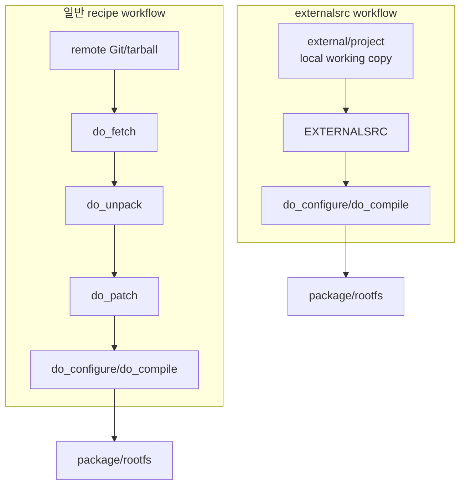
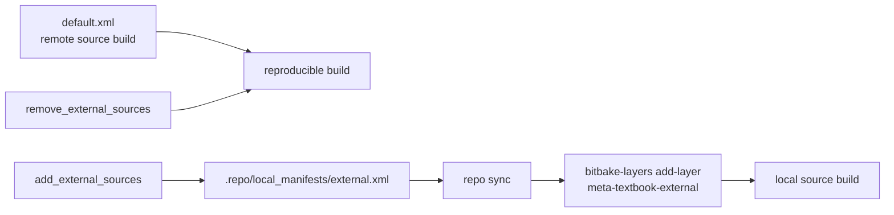

# 06. external source 개발 구조

[학습 순서로 돌아가기](../README.md#추천-학습-순서)

관련 commit:

- `a561318 build: Add infrastructure for managing external sources and layers`
- `695ba6a build: Consolidate external layers into a single meta-textbook-external layer`
- `be7aa91 external: Align PV generation logic for kernel and kernel module recipes`

## 필요한 상황

remote Git에서 fetch한 source 대신, 개발자가 수정 중인 local working copy를 Yocto가 바로 build하게 하고 싶다면 `externalsrc` layer를 추가한다.



## 추가하면 되는 것

- external source repo를 가져올 manifest
- external source용 layer
- 기존 recipe를 덮는 `.bbappend`
- `.bbappend` 안의 `inherit externalsrc`
- `EXTERNALSRC`, `EXTERNALSRC_BUILD`
- local Git revision을 반영하는 `PV`
- layer 추가/제거 helper

## 이 프로젝트의 구현

파일:

- `.repo/manifests/external.xml`
- `meta-textbook-external/conf/layer.conf`
- `meta-textbook-external/recipes-linux/linux/linux-textbook.bbappend`
- `meta-textbook-external/recipes-linux/hello-module/hello-module.bbappend`
- `meta-textbook-external/recipes-application/*/*.bbappend`
- `meta-textbook-external/recipes-library/*/*.bbappend`
- `envsetup.sh`

사용 함수:

```sh
add_external_sources
remove_external_sources
```

대표 구현:

```bitbake
inherit externalsrc
EXTERNALSRC = "${COREBASE}/../external/hello-makefile-application"
EXTERNALSRC_BUILD = "${WORKDIR}/build"

SRCREV = "${AUTOREV}"
EXTERNALSRC_GIT_REV := "${@__import__('subprocess').check_output(['git', '-C', d.getVar('EXTERNALSRC'), 'rev-parse', '--short=10', 'HEAD'], text=True).strip()}"
PV = "${HELLO_MAKEFILE_APPLICATION_VERSION}+git0+${EXTERNALSRC_GIT_REV}"
```

Kernel에 `externalsrc`를 적용할 때는 config fragment를 수동으로 merge한다.

```bitbake
do_configure:append() {
    ${S}/scripts/kconfig/merge_config.sh -m -O ${B} \
        ${B}/.config ${KERNEL_CONFIG_FRAGMENTS}
    oe_runmake -C ${S} O=${B} olddefconfig
}
```

## external source 사용 시 주의할 점

`externalsrc`는 개발 속도를 높여주지만, 일반 recipe의 `fetch/unpack/patch` workflow를 일부 건너뛰기 때문에 몇 가지 주의점이 생긴다.

| 문제 | 왜 발생하나 | 대응 |
| --- | --- | --- |
| 재현성이 낮아진다 | local working copy 상태가 build 입력이 된다 | release/CI build는 고정 `SRCREV`와 remote source recipe를 사용한다 |
| uncommitted 변경 추적이 어렵다 | 이 프로젝트의 `PV`는 Git `HEAD` 기준이라 working tree dirty 상태는 반영하지 않는다 | external source 변경은 commit 후 build하고, 필요하면 `git diff`를 별도 확인한다 |
| package version이 뒤로 가는 error가 날 수 있다 | remote recipe의 `PV`와 externalsrc recipe의 `PV` 순서가 충돌할 수 있다 | `PV = "...+git0+${EXTERNALSRC_GIT_REV}"`처럼 external source용 version 규칙을 둔다 |
| patch가 적용되지 않을 수 있다 | `externalsrc`는 이미 준비된 source tree를 쓰므로 fetch/unpack/patch 기대와 다르다 | patch를 recipe에 둘지, 외부 repo commit으로 둘지 정책을 정한다 |
| kernel config fragment가 누락될 수 있다 | kernel `externalsrc`에서는 `kernel-yocto`의 config pipeline이 일반 workflow와 다르게 동작할 수 있다 | `merge_config.sh`와 `olddefconfig`로 fragment를 수동 merge한다 |
| build directory가 source tree를 오염시킬 수 있다 | in-tree build로 잡으면 source repo에 output이 섞인다 | application/library는 `EXTERNALSRC_BUILD = "${WORKDIR}/build"`처럼 out-of-tree build를 쓴다 |
| sstate/cache 판단이 헷갈릴 수 있다 | local source 변화가 task signature에 기대한 방식으로 반영되지 않을 수 있다 | 문제가 의심되면 `-c compile -f`, `-c cleansstate`로 재실행한다 |
| 여러 개발자의 경로가 다를 수 있다 | `EXTERNALSRC`가 workspace 상대 경로를 전제한다 | `${COREBASE}/../external/...`처럼 repo workspace 기준 상대 경로를 쓴다 |
| CI에서 실패할 수 있다 | CI checkout에 external source repo가 없거나 local manifest가 적용되지 않을 수 있다 | CI에서는 `repo sync` 범위와 `external.xml` 사용 여부를 명확히 한다 |
| license/checksum 검증이 약해질 수 있다 | source가 local working copy라 release source와 달라질 수 있다 | release 시 remote recipe 기준으로 `LIC_FILES_CHKSUM`과 source revision을 다시 검증한다 |

## 이 프로젝트의 대응 방식

### 1. external source layer를 명시적으로 켜고 끈다

external source는 기본 build에 항상 섞어 두지 않고 helper로 켠다.



```sh
add_external_sources
remove_external_sources
```

이 방식은 “재현 가능한 기본 build”와 “local source 개발 build”를 구분한다.

### 2. version going backwards를 피한다

external Git source의 짧은 commit hash를 `PV`에 넣는다.

```bitbake
EXTERNALSRC_GIT_REV := "${@__import__('subprocess').check_output(['git', '-C', d.getVar('EXTERNALSRC'), 'rev-parse', '--short=10', 'HEAD'], text=True).strip()}"
PV = "${HELLO_MAKEFILE_APPLICATION_VERSION}+git0+${EXTERNALSRC_GIT_REV}"
```

kernel도 같은 방식이다.

```bitbake
PV = "${LINUX_VERSION}+git0+${EXTERNALSRC_GIT_REV}"
```

이 처리는 package manager나 buildhistory에서 version이 예상보다 낮아졌다고 판단하는 상황을 줄여준다.

### 3. application/library는 out-of-tree build를 사용한다

```bitbake
EXTERNALSRC = "${COREBASE}/../external/hello-cmake-application"
EXTERNALSRC_BUILD = "${WORKDIR}/build"
```

source repo에는 source만 두고, build output은 Yocto workdir 아래에 둔다. 즉, working copy를 깨끗하게 유지하기 위한 configuration이다.

### 4. kernel module은 source tree 안에서 Kbuild를 수행한다

```bitbake
EXTERNALSRC = "${COREBASE}/../external/hello-module"
EXTERNALSRC_BUILD = "${EXTERNALSRC}"
S = "${EXTERNALSRC}"
SRC_URI = ""
```

kernel module은 Kbuild 특성상 source tree 기준으로 build하는 방식이 단순하다. 대신 output과 임시 file이 source tree에 생길 수 있으므로 `git status`로 오염 여부를 확인하는 습관이 필요하다.

### 5. kernel config fragment를 수동 병합한다

```bitbake
KERNEL_CONFIG_FRAGMENTS = "\
    ${THISDIR}/files/qemuarm64.cfg \
    ${THISDIR}/files/qemuarm64-ext.cfg \
"

do_configure:append() {
    ${S}/scripts/kconfig/merge_config.sh -m -O ${B} \
        ${B}/.config ${KERNEL_CONFIG_FRAGMENTS}
    oe_runmake -C ${S} O=${B} olddefconfig
}
```

`externalsrc`를 kernel에 적용하면 일반 kernel recipe의 configuration workflow와 다르게 움직일 수 있다. 그래서 이 프로젝트는 config fragment merge를 명시적으로 수행한다.

## external source debugging 체크리스트

external source를 켰는데 예상대로 build가 되지 않으면 다음 순서로 확인한다.

```sh
bitbake-layers show-layers | grep meta-textbook-external
bitbake-layers show-appends | grep hello-makefile-application
bitbake-getvar -r hello-makefile-application EXTERNALSRC
bitbake-getvar -r hello-makefile-application EXTERNALSRC_BUILD
bitbake-getvar -r hello-makefile-application PV
git -C external/hello-makefile-application status --short
```

kernel external source 확인:

```sh
bitbake-getvar -r linux-textbook EXTERNALSRC
bitbake-getvar -r linux-textbook KERNEL_CONFIG_FRAGMENTS
bitbake linux-textbook -c configure -f
find build/tmp/work -path '*linux-textbook*' -path '*temp/log.do_configure*'
```

강제로 rebuild:

```sh
bitbake hello-makefile-application -c compile -f
bitbake hello-makefile-application -c cleansstate
bitbake hello-makefile-application
```

## 핵심 메시지

일반 Yocto recipe는 source fetch부터 시작한다. 하지만 개발 중에는 fetch/unpack을 반복하는 것보다 local source tree를 바로 build하는 편이 더 빠르다. `externalsrc`는 “Yocto packaging workflow는 유지하되 source만 working copy로 바꾸는 방법”이다.

다만 `externalsrc`는 release 재현성과 충돌할 수 있다. 그래서 external source layer를 명시적으로 켜고 끄고, Git commit 기준으로 version을 만들고, kernel config처럼 일반 workflow와 달라지는 부분은 수동으로 보완한다.

`devtool`과 비교하면, `externalsrc`는 프로젝트가 정한 장기 개발 source tree를 연결하는 방식이고, `devtool`은 임시 workspace에서 recipe를 수정하고 patch로 정리하는 방식이다. 이 차이를 뒤의 devtool 장과 연결해서 설명하면 좋다.

## 확인 command

```sh
source envsetup.sh
add_external_sources
bitbake-layers show-layers | grep meta-textbook-external
bitbake-getvar -r hello-makefile-application EXTERNALSRC
```
