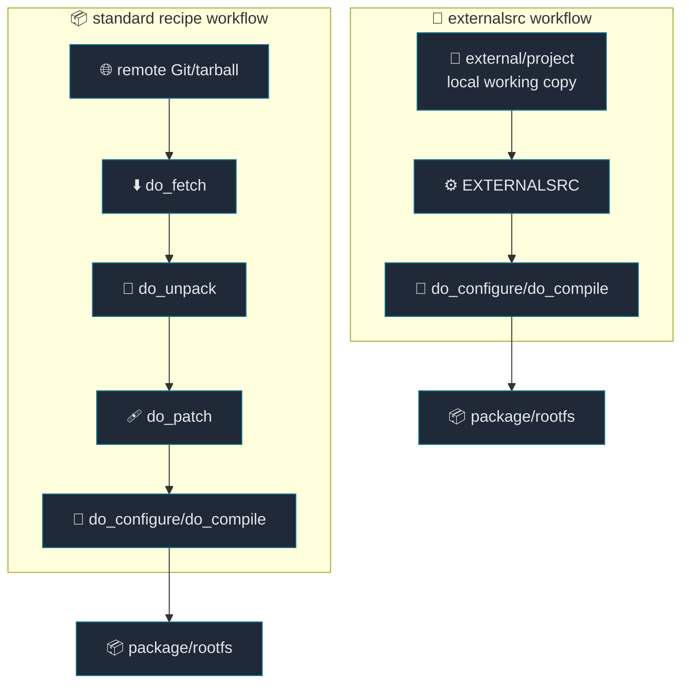
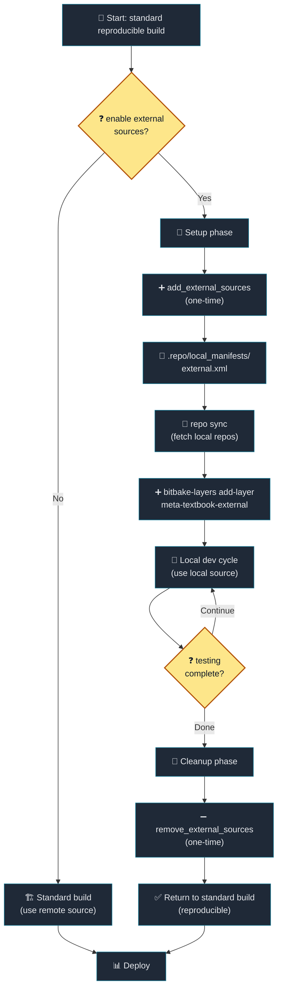

# 06. External Source Development

[Back to Learning Path](../README.md#learning-path)

Related Commit:

- `a561318 build: Add infrastructure for managing external sources and layers`
- `695ba6a build: Consolidate external layers into a single meta-textbook-external layer`
- `be7aa91 external: Align PV generation logic for kernel and kernel module recipes`

## When to Use

Add the `externalsrc` layer when you want Yocto to build directly from a local working copy instead of fetching source from remote Git or a tarball.

## What This Chapter Covers

This chapter explains the difference between the standard recipe workflow and the `externalsrc` workflow. Release and CI builds should use remote source plus a fixed `SRCREV` for reproducibility. During active development, `externalsrc` can switch selected recipes to local source trees so developers can build and test changes quickly.



**Difference:**

| Workflow | Source location | Skipped steps | Strength | Watch out for |
| --- | --- | --- | --- | --- |
| Standard recipe | remote Git/tarball | none | reproducible release/CI builds | slower edit/build iteration |
| `externalsrc` | local working copy | parts of `fetch`, `unpack`, `patch` | builds the source you are editing | local paths and dirty trees must be managed |

## Required Additions

| Item | Description |
| --- | --- |
| external source manifest | Syncs local development repositories into the workspace. |
| external source layer | Keeps local-source overrides separate from release metadata. |
| recipe `.bbappend` files | Preserve the base recipe and override only development behavior. |
| `inherit externalsrc` | Tells BitBake to use a local source tree for the recipe. |
| `EXTERNALSRC`, `EXTERNALSRC_BUILD` | Split source and build directories. |
| Git-revision-based `PV` | Reduces package version rollback issues during local builds. |
| add/remove helper functions | Switch between reproducible builds and local development builds. |

## Project Implementation

```text
.
├── .repo
│   └── manifests
│       └── external.xml
└── layers
    └── meta-textbook
        ├── envsetup.sh
        └── meta-textbook-external
            ├── conf
            │   └── layer.conf
            ├── recipes-linux
            │   ├── linux
            │   │   └── linux-textbook.bbappend
            │   └── hello-module
            │       └── hello-module.bbappend
            ├── recipes-application
            │   └── */*.bbappend
            └── recipes-library
                └── */*.bbappend
```

Helper functions:

```sh
add_external_sources
remove_external_sources
```

Typical `.bbappend` pattern:

```bitbake
inherit externalsrc
EXTERNALSRC = "${COREBASE}/../external/hello-makefile-application"
EXTERNALSRC_BUILD = "${WORKDIR}/build"

SRCREV = "${AUTOREV}"
EXTERNALSRC_GIT_REV := "${@__import__('subprocess').check_output(['git', '-C', d.getVar('EXTERNALSRC'), 'rev-parse', '--short=10', 'HEAD'], text=True).strip()}"
PV = "${HELLO_MAKEFILE_APPLICATION_VERSION}+git0+${EXTERNALSRC_GIT_REV}"
```

When `externalsrc` is used for the kernel, this project explicitly merges kernel config fragments:

```bitbake
do_configure:append() {
    ${S}/scripts/kconfig/merge_config.sh -m -O ${B} \
        ${B}/.config ${KERNEL_CONFIG_FRAGMENTS}
    oe_runmake -C ${S} O=${B} olddefconfig
}
```

## What to Watch Out For

`externalsrc` speeds up local development, but it changes the normal source preparation path. The local working copy becomes a build input, so the build is no longer defined only by the recipe and `SRCREV`.

### Source and Reproducibility

| Issue | Cause | Response |
| --- | --- | --- |
| Lower reproducibility | The local working copy is the source input. | Use fixed `SRCREV` and remote source recipes for release/CI. |
| Dirty-tree changes are easy to miss | `PV` follows Git `HEAD`, not uncommitted changes. | Commit local changes before build, or inspect `git diff` separately. |
| License/checksum drift | Local source may differ from the release source. | Re-check `LIC_FILES_CHKSUM` when moving back to release recipes. |

### Build and Version

| Issue | Cause | Response |
| --- | --- | --- |
| Package version conflict | Remote and local-source builds can produce different `PV` values. | Include the local Git revision in `PV`. |
| Recipe patches may not apply | `externalsrc` starts from an already-prepared tree. | Decide whether a change belongs in the recipe patch or in the external repo. |
| Build output pollutes source | In-tree builds can leave generated files in the working copy. | Use `EXTERNALSRC_BUILD = "${WORKDIR}/build"` when the project supports out-of-tree builds. |

### Kernel and Configuration

| Issue | Cause | Response |
| --- | --- | --- |
| Missing kernel config fragment | The kernel config flow differs from the standard recipe path. | Merge fragments explicitly with `merge_config.sh` and `olddefconfig`. |
| Stale build result | Local source changes may interact with sstate unexpectedly. | Re-run with `-c compile -f`, or use `-c cleansstate` when needed. |

### Environment and CI

| Issue | Cause | Response |
| --- | --- | --- |
| Different developer paths | `EXTERNALSRC` assumes a workspace-relative layout. | Use paths such as `${COREBASE}/../external/...`. |
| CI checkout does not contain external source | The local manifest or external repositories were not synced. | Make `external.xml` usage explicit in the workflow. |

## Project Strategy

### 1. Enable and Disable the External Layer Explicitly

The external source layer is not always part of the default build. It is enabled only when local-source development is needed.



| Step | Type | Action | Result |
| --- | --- | --- | --- |
| Setup phase | one-time | Run `add_external_sources`. | Local manifest and external layer are enabled. |
| Dev cycle | iterative | Edit source and rebuild with BitBake. | Fast local feedback. |
| Cleanup phase | one-time | Run `remove_external_sources`. | Build returns to standard recipes. |
| Result | deployment baseline | Build from remote source again. | Reproducible state is restored. |

`remove_external_sources` removes the external layer from `conf/bblayers.conf`. It does not delete `.repo/local_manifests/external.xml` or the `external/` checkout.

### 2. Avoid Version Rollback Warnings

External Git source recipes include a short commit hash in `PV`:

```bitbake
PV = "${HELLO_MAKEFILE_APPLICATION_VERSION}+git0+${EXTERNALSRC_GIT_REV}"
```

This helps package managers and buildhistory understand that the package version came from a specific local Git revision.

### 3. Keep Application Builds Out of Tree

```bitbake
EXTERNALSRC_BUILD = "${WORKDIR}/build"
```

The source tree stays clean while build output lives under the Yocto work directory.

### 4. Handle Kernel Modules Carefully

Kernel modules often build through Kbuild from the module source directory. That is simple, but generated files can appear in the working copy, so check `git status` after repeated builds.

### 5. Merge Kernel Config Fragments Explicitly

Kernel `externalsrc` may not follow the same config path as the standard kernel recipe. This project compensates by merging fragments during `do_configure:append()`.

## Verification Commands

```sh
bitbake-layers show-layers | grep meta-textbook-external
bitbake-layers show-appends | grep hello-makefile-application
bitbake-getvar -r hello-makefile-application EXTERNALSRC
git -C ../external/hello-makefile-application status --short
bitbake hello-makefile-application -c compile -f
```

Kernel external source check:

```sh
bitbake-getvar -r linux-textbook EXTERNALSRC
bitbake linux-textbook -c configure -f
```

## Key Takeaway

`externalsrc` keeps the Yocto packaging workflow but swaps the recipe source input to a local working copy. Use it for fast local development, not as the release baseline. The project keeps that distinction clear by enabling the external layer explicitly, deriving `PV` from Git, and restoring the standard recipe path when local testing is finished.
