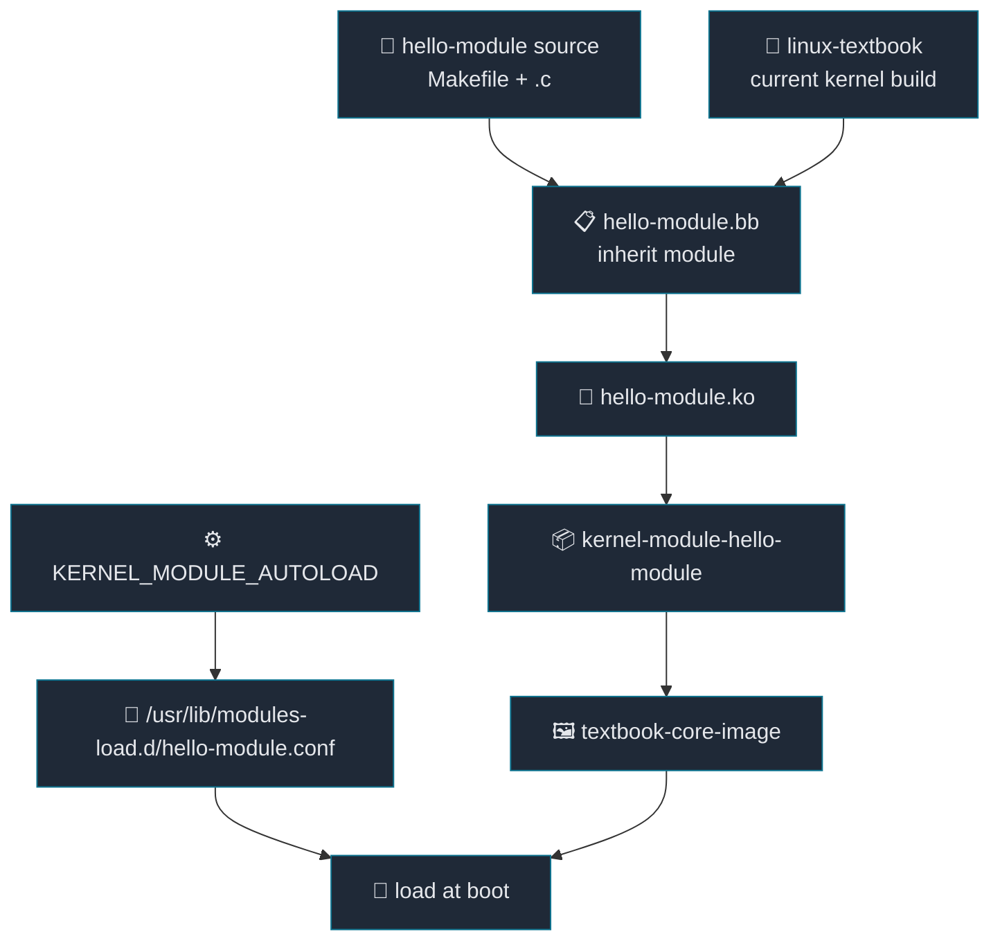

# 07. Adding a Kernel Module to the Image

[Back to Learning Path](../README.md#learning-path)

Related Commit:

- `d8df46c textbook: Add hello-module recipe and include it as an essential dependency`
- `2bfa3fc external: Append hello-module to support local external source tree`

## When to Use

Add a kernel module recipe when the product image must include a `.ko` file and load it automatically during boot.

## What This Chapter Covers

This chapter explains how to build an out-of-tree kernel module against the kernel currently used by the image. It connects `inherit module`, `RPROVIDES`, `KERNEL_MODULE_AUTOLOAD`, and machine runtime dependencies into one flow.

## Concept

A kernel module is a binary that is loaded into kernel space after the kernel has booted. It is closer to a driver or kernel plugin than a normal application. A user-space application mainly depends on libc, headers, and shared libraries. A kernel module depends directly on the kernel version, kernel configuration, exported symbols, and module ABI.

That is why a module recipe should not simply run a random compiler against the module source. It must build the `.ko` file using the same kernel build context as the image. In this project, `linux-textbook` provides `virtual/kernel`, and the `hello-module` recipe builds `hello-module.ko` against that kernel.

| Concept | Description |
| --- | --- |
| out-of-tree module | Module source kept outside the main kernel source tree. |
| Kbuild `obj-m` | Makefile rule that tells the kernel build system which object becomes a module. |
| `inherit module` | Yocto class that wires the recipe to the current kernel build directory, headers, and symbols. |
| `kernel-module-*` package | Runtime package name used for kernel module packages. |
| `KERNEL_MODULE_AUTOLOAD` | Creates modules-load configuration so the module loads at boot. |



## Required Additions

| Item | Description |
| --- | --- |
| kernel module source repository | Source that will become the `.ko` file. |
| `inherit module` recipe | Builds the module against the active kernel build environment. |
| `RPROVIDES:${PN}` | Exposes the runtime package name as `kernel-module-*`. |
| `KERNEL_MODULE_AUTOLOAD` | Selects the module to load during boot. |
| machine/packagegroup runtime dependency | Pulls the module package into the image. |
| `externalsrc` `.bbappend` | Allows local module-source development builds. |

## Project Implementation

```text
.
├── external
│   └── hello-module
└── layers
    └── meta-textbook
        ├── meta-textbook-core-bsp
        │   ├── conf/machine/textbook.conf
        │   └── recipes-linux/hello-module/hello-module.bb
        └── meta-textbook-external
            └── recipes-linux/hello-module/hello-module.bbappend
```

Recipe:

```bitbake
inherit module

SRC_URI = "git://github.com/yocto-textbook/hello-module.git;protocol=https;branch=main"
SRCREV = "${AUTOREV}"
S = "${WORKDIR}/git"

RPROVIDES:${PN} += "kernel-module-hello-module"
KERNEL_MODULE_AUTOLOAD += "hello-module"
ALLOW_EMPTY:${PN} = "1"
```

Source Makefile:

```make
obj-m := hello-module.o
SRC := $(shell pwd)

all:
	$(MAKE) -C $(KERNEL_SRC) M=$(SRC) modules
```

The `module` class prepares `KERNEL_SRC` and the kernel build context. The source Makefile can then call Kbuild with `$(MAKE) -C $(KERNEL_SRC) M=$(SRC) modules`.

| Variable | Description |
| --- | --- |
| `inherit module` | Provides compile, install, and package tasks for kernel modules. |
| `S = "${WORKDIR}/git"` | Points to the source unpacked by the Git fetcher. |
| `RPROVIDES:${PN}` | Makes the recipe package also provide `kernel-module-hello-module`. |
| `KERNEL_MODULE_AUTOLOAD` | Generates modules-load configuration in the rootfs. |
| `ALLOW_EMPTY:${PN}` | Allows the main package to be empty when files are split into module packages. |

Machine dependency:

```bitbake
MACHINE_ESSENTIAL_EXTRA_RDEPENDS += "\
    kernel-module-hello-module \
"
```

`MACHINE_ESSENTIAL_EXTRA_RDEPENDS` pulls runtime packages that are essential for this machine into the image. Here it ensures that `textbook-core-image` includes the module package.

| Result | Description |
| --- | --- |
| `/lib/modules/<kernel-version>/.../hello-module.ko` | Kernel module binary loaded by the target. |
| `/usr/lib/modules-load.d/hello-module.conf` | Boot-time auto-load configuration. |
| `kernel-module-hello-module-*` package | Runtime package installed into the image/rootfs. |

## Key Takeaway

A kernel module package is tied to the kernel version and configuration. `inherit module` builds it with the same kernel context as the image, while `KERNEL_MODULE_AUTOLOAD` plus the machine dependency turns it from a compiled `.ko` into a module that is installed and loaded on the target.

## Verification Commands

```sh
bitbake hello-module
grep kernel-module-hello buildhistory/images/textbook/glibc/textbook-core-image/installed-package-names.txt
find tmp/work -path '*textbook-core-image*' -path '*rootfs/usr/lib/modules-load.d/hello-module.conf'
```
