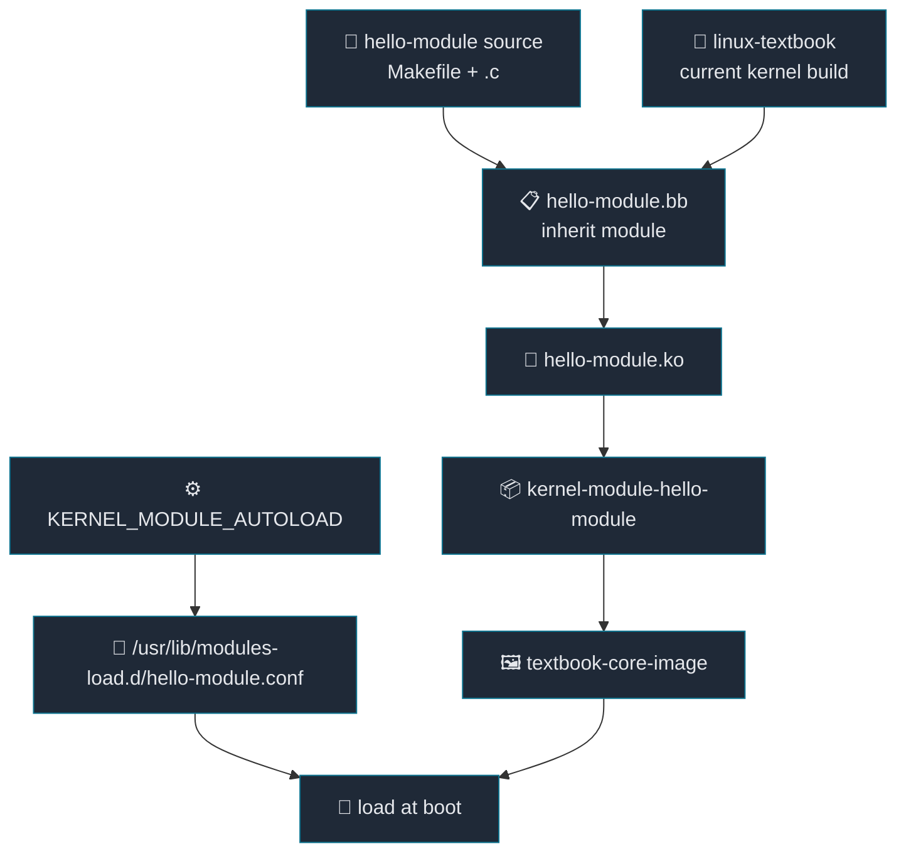

# 07. kernel module을 image에 포함하기

[Back to Learning Path](../README.md#learning-path)

Related Commit:

- `d8df46c textbook: Add hello-module recipe and include it as an essential dependency`
- `2bfa3fc external: Append hello-module to support local external source tree`

## When to Use

제품 image에 kernel module을 포함하고, 부팅 시 자동 로드되게 하고 싶다면 kernel module recipe를 추가한다.

## What This Chapter Covers

이 chapter는 out-of-tree kernel module을 현재 build 중인 kernel과 맞춰 build하고 image에 포함하는 방법을 설명한다. `inherit module`, `RPROVIDES`, `KERNEL_MODULE_AUTOLOAD`, machine runtime dependency가 각각 어떤 역할을 하는지 연결한다.

## Concept

kernel module은 kernel에 나중에 붙는 driver/plugin 같은 binary다. 일반 application은 user space에서 실행되지만, kernel module은 kernel space에 load되어 kernel symbol과 ABI에 직접 의존한다. 그래서 같은 source라도 어떤 kernel version/config/header로 build했는지가 중요하다.

Yocto에서 out-of-tree kernel module을 다룰 때 핵심은 “module source를 그냥 compile하는 것”이 아니라, 현재 image가 사용하는 kernel recipe의 build environment와 맞춰 `.ko`를 만드는 것이다. 이 프로젝트에서는 `linux-textbook`이 `virtual/kernel` provider이고, `hello-module` recipe가 그 kernel build tree를 사용해 `hello-module.ko`를 만든다.

| 개념 | Description |
| --- | --- |
| out-of-tree module | kernel source tree 밖에 따로 있는 module source |
| Kbuild `obj-m` | 어떤 object를 module로 build할지 kernel build system에 알려주는 Makefile 규칙 |
| `inherit module` | Yocto가 현재 kernel의 build directory/header/symbol 정보를 연결해 module을 build하도록 하는 class |
| `kernel-module-*` package | rootfs package manager가 설치하는 kernel module package 이름 |
| `KERNEL_MODULE_AUTOLOAD` | boot 시 module을 자동 load하도록 modules-load 설정을 생성 |

일반 application recipe가 `CC`, `CFLAGS`, library dependency를 중심으로 움직인다면, kernel module recipe는 `KERNEL_SRC`, kernel config, module symbol, kernel package naming을 중심으로 움직인다. 이 차이 때문에 `inherit module`을 사용한다.



## Required Additions

| 항목 | 역할 |
| --- | --- |
| kernel module source repo | `.ko`로 build할 module source |
| `inherit module` recipe | 현재 kernel build environment에 맞춰 module build |
| `RPROVIDES:${PN}` | runtime package 이름을 `kernel-module-*` 형태로 제공 |
| `KERNEL_MODULE_AUTOLOAD` | boot 시 자동 load 대상 지정 |
| machine/packagegroup runtime dependency | image에 module package 포함 |
| `externalsrc` `.bbappend` | local module source로 개발 build |

## Project Implementation

```text
.
├── external
│   └── hello-module
└── layers
    └── meta-textbook
        ├── meta-textbook-core-bsp
        │   ├── conf/machine/textbook.conf
        │   └── recipes-linux/hello-module/hello-module.bb
        └── meta-textbook-external
            └── recipes-linux/hello-module/hello-module.bbappend
```

recipe:

```bitbake
inherit module

SRC_URI = "git://github.com/yocto-textbook/hello-module.git;protocol=https;branch=main"
SRCREV = "${AUTOREV}"
S = "${WORKDIR}/git"

RPROVIDES:${PN} += "kernel-module-hello-module"
KERNEL_MODULE_AUTOLOAD += "hello-module"
ALLOW_EMPTY:${PN} = "1"
```

source Makefile:

```make
obj-m := hello-module.o
SRC := $(shell pwd)

all:
	$(MAKE) -C $(KERNEL_SRC) M=$(SRC) modules
```

`module` class가 `KERNEL_SRC`와 module build에 필요한 kernel context를 준비해 주기 때문에, source Makefile은 Kbuild 규칙에 맞춰 `$(MAKE) -C $(KERNEL_SRC) M=$(SRC) modules`를 호출하면 된다.

recipe 변수 역할:

| variable | Description |
| --- | --- |
| `inherit module` | kernel module용 compile/install/package task 제공 |
| `S = "${WORKDIR}/git"` | Git fetcher가 unpack한 source 위치 지정 |
| `RPROVIDES:${PN}` | recipe package가 `kernel-module-hello-module` 이름도 제공하도록 연결 |
| `KERNEL_MODULE_AUTOLOAD` | rootfs에 modules-load 설정을 생성해 boot 시 자동 load |
| `ALLOW_EMPTY:${PN}` | main package가 비어 있어도 QA error가 나지 않게 허용 |

machine dependency:

```bitbake
MACHINE_ESSENTIAL_EXTRA_RDEPENDS += "\
    kernel-module-hello-module \
"
```

`MACHINE_ESSENTIAL_EXTRA_RDEPENDS`는 이 machine에서 반드시 필요한 runtime package를 image에 끌어오는 역할을 한다. 여기서는 `kernel-module-hello-module`을 machine essential dependency로 넣었기 때문에, `textbook-core-image`를 만들 때 module package가 rootfs에 포함된다.

build 결과는 rootfs 안에서 다음 형태로 이어진다.

| 결과 | Description |
| --- | --- |
| `/lib/modules/<kernel-version>/.../hello-module.ko` | 실제 load되는 kernel module binary |
| `/usr/lib/modules-load.d/hello-module.conf` | boot 시 `hello-module`을 자동 load하기 위한 설정 |
| `kernel-module-hello-module-*` package | image/rootfs에 설치되는 module package |

## Key Takeaway

kernel module은 application package와 다르게 kernel version과 kernel config에 묶인다. Yocto의 `module` class를 쓰면 현재 build 중인 kernel과 맞는 module package를 만들 수 있고, `KERNEL_MODULE_AUTOLOAD`와 machine dependency를 함께 쓰면 “build만 되는 module”이 아니라 “image에 포함되고 boot 시 load되는 module”까지 연결할 수 있다.

## Verification Commands

```sh
bitbake hello-module
grep kernel-module-hello buildhistory/images/textbook/glibc/textbook-core-image/installed-package-names.txt
find tmp/work -path '*textbook-core-image*' -path '*rootfs/usr/lib/modules-load.d/hello-module.conf'
```
