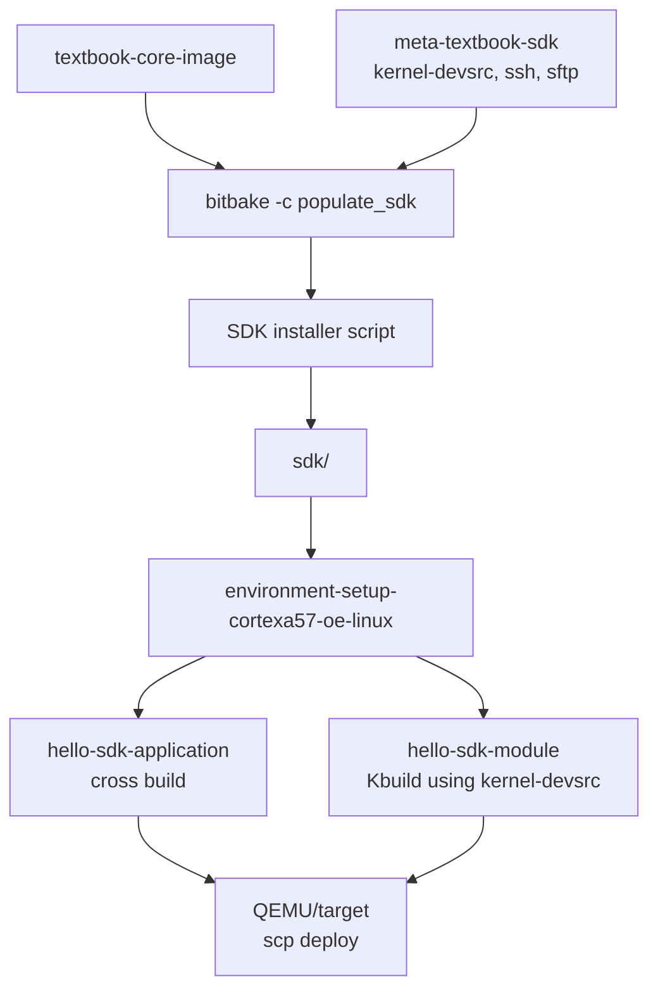

# 13. SDK 생성과 SDK 기반 개발

[학습 순서로 돌아가기](../README.md#추천-학습-순서)

관련 commit:

- `5baa5aa envsetup, meta-textbook-sdk: add SDK layer and automated installation helper`

## 필요한 상황

Yocto build tree 밖에서 application이나 out-of-tree kernel module을 build할 수 있는 SDK를 제공하고 싶다면 SDK layer와 `populate_sdk` helper를 추가한다.

## 추가하면 되는 것

- SDK 확장 layer
- image recipe `.bbappend`
- `TOOLCHAIN_TARGET_TASK` 확장
- target image의 SSH/SFTP feature
- SDK 설치 helper 함수
- SDK를 source하는 외부 예제 프로젝트

## 이 프로젝트의 구현

파일:

- `meta-textbook-sdk/conf/layer.conf`
- `meta-textbook-sdk/appends/image/textbook-core-image.bbappend`
- `envsetup.sh`
- `external/hello-sdk-application`
- `external/hello-sdk-module`
- `sdk/environment-setup-cortexa57-oe-linux`



SDK layer:

```bitbake
TOOLCHAIN_TARGET_TASK:append = " kernel-devsrc"
EXTRA_IMAGE_FEATURES += "ssh-server-openssh"
IMAGE_INSTALL:append = " openssh-sftp-server"
```

설치 helper:

```sh
install_sdk() {
    local sdk_dir=${WORKSPACE_BASE}/sdk
    local sdk_script=textbook-systemd-distro-glibc-x86_64-textbook-core-image-cortexa57-textbook-toolchain-1.0.0.sh

    mkdir -p ${sdk_dir}
    bitbake textbook-core-image -c populate_sdk
    ${WORKSPACE_BASE}/${BUILD_DIR}/tmp/deploy/sdk/${sdk_script} ${sdk_dir}/
}
```

SDK 환경:

```sh
export SDKTARGETSYSROOT=.../sdk/sysroots/cortexa57-oe-linux
export OECORE_TARGET_ARCH="aarch64"
export ARCH=arm64
export CROSS_COMPILE=aarch64-oe-linux-
export CC="aarch64-oe-linux-gcc ... --sysroot=$SDKTARGETSYSROOT"
```

## SDK 앱 개발

```sh
cd external/hello-sdk-application
source envsetup.sh
make
make install TARGET_IP=192.168.7.2
```

핵심:

```make
CC ?= $(CROSS_COMPILE)gcc
$(CC) $(CFLAGS) -o $@ $^ $(LDFLAGS)
scp $< root@$(TARGET_IP):/home/root/
```

## SDK kernel module 개발

```sh
cd external/hello-sdk-module
source envsetup.sh
make
make install TARGET_IP=192.168.7.2
```

핵심:

```make
KERNEL_SRC ?= ${SDKTARGETSYSROOT}/usr/src/kernel
obj-m := $(TARGET).o

$(TARGET).ko: modules_prepare
	$(MAKE) -C $(KERNEL_SRC) M=$(SRC) modules
```

## 핵심 메시지

BitBake는 제품 image를 재현 가능하게 만드는 tool이고, SDK는 그 image와 ABI가 맞는 외부 개발 환경을 제공하는 tool이다. `kernel-devsrc`를 SDK에 포함했기 때문에 일반 앱뿐 아니라 out-of-tree kernel module까지 SDK만으로 build할 수 있다.

SDK가 “build tree 밖에서 개발하는 환경”이라면, `devtool`은 “Yocto build/workspace 안에서 recipe 개발을 빠르게 하는 tool”이다. 둘 다 개발 속도를 높이지만, output을 layer에 반영하는 방식은 다르다.

## 확인 command

```sh
source envsetup.sh
install_sdk
source sdk/environment-setup-cortexa57-oe-linux
echo $CC
echo $SDKTARGETSYSROOT

cd external/hello-sdk-application
source envsetup.sh
make

cd ../hello-sdk-module
source envsetup.sh
make
```
