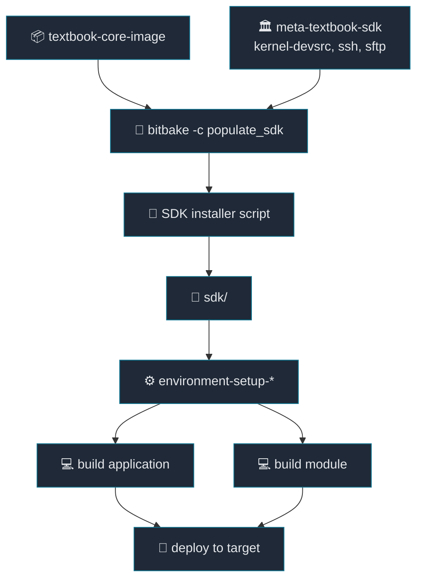

# 13. SDK 생성과 SDK 기반 개발

[Back to Learning Path](../README.md#learning-path)

Related Commit:

- `5baa5aa envsetup, meta-textbook-sdk: add SDK layer and automated installation helper`

## When to Use

Yocto build tree 밖에서 application이나 out-of-tree kernel module을 build할 수 있는 SDK를 제공하고 싶다면 SDK layer와 `populate_sdk` helper를 추가한다.

## What This Chapter Covers

이 chapter는 target image와 ABI가 맞는 외부 개발 환경을 만드는 SDK workflow를 설명한다. `populate_sdk`, SDK installer, `environment-setup-*`, `kernel-devsrc`가 application과 kernel module 개발에 어떻게 연결되는지 다룬다.

## Concept

SDK(Software Development Kit)는 Yocto build tree 밖에서 target용 binary를 만들 수 있게 해 주는 개발 도구 묶음이다. target architecture용 cross compiler, sysroot, header, library, pkg-config metadata, environment setup script가 포함된다.

Yocto image를 build한 host 환경과, application 개발자가 쓰는 개발 환경은 항상 같지 않다. SDK를 제공하면 개발자는 전체 BitBake workspace를 알 필요 없이 `environment-setup-*` file을 source하고 target ABI에 맞는 application이나 out-of-tree kernel module을 build할 수 있다.

| 구성 요소 | 역할 |
| --- | --- |
| cross compiler | x86_64 host에서 ARM64 target binary build |
| target sysroot | target rootfs와 ABI가 맞는 header/library 제공 |
| `environment-setup-*` | `CC`, `CXX`, `PKG_CONFIG_SYSROOT_DIR`, `ARCH`, `CROSS_COMPILE` 같은 변수 설정 |
| SDK installer | `populate_sdk` 결과물을 개발자 PC에 설치 |
| `kernel-devsrc` | SDK에서 out-of-tree kernel module을 build할 수 있게 kernel source/header 제공 |

정리하면 SDK는 “제품 image와 ABI가 맞는 외부 개발 환경”이다. BitBake는 image와 package를 재현 가능하게 만들고, SDK는 그 결과물 위에서 별도 source project를 빠르게 build/test하게 해 준다.

## Required Additions

| 항목 | 역할 |
| --- | --- |
| SDK 확장 layer | SDK 관련 정책을 별도 layer로 분리 |
| image recipe `.bbappend` | SDK와 target image feature 확장 |
| `TOOLCHAIN_TARGET_TASK` | SDK에 target 개발 package 추가 |
| SSH/SFTP image feature | SDK output을 target에 deploy하기 위한 runtime 환경 |
| SDK 설치 helper 함수 | `populate_sdk`와 installer 실행 자동화 |
| 외부 예제 프로젝트 | SDK를 source해서 app/module을 build하는 예제 |

## Project Implementation

```text
.
├── envsetup.sh
├── external
│   ├── hello-sdk-application
│   └── hello-sdk-module
├── sdk
│   └── environment-setup-cortexa57-oe-linux
└── layers
    └── meta-textbook
        └── meta-textbook-sdk
            ├── conf/layer.conf
            └── appends/image/textbook-core-image.bbappend
```



**SDK workflow:**

| 단계 | command/동작 | 결과 |
| --- | --- | --- |
| One-time setup | `bitbake -c populate_sdk` → installer 실행 | `sdk/environment-setup-*` 생성 |
| Dev cycle | SDK 환경 source 후 app/module build | build tree 밖에서 target binary 생성 |
| Deploy/test loop | `make install TARGET_IP=...` 후 target에서 확인 | image ABI와 맞는 결과물 검증 |

SDK layer:

```bitbake
TOOLCHAIN_TARGET_TASK:append = " kernel-devsrc"
EXTRA_IMAGE_FEATURES += "ssh-server-openssh"
IMAGE_INSTALL:append = " openssh-sftp-server"
```

Install Helper:

```sh
install_sdk() {
    local sdk_dir=${WORKSPACE_BASE}/sdk
    local sdk_script=textbook-systemd-distro-glibc-x86_64-textbook-core-image-cortexa57-textbook-toolchain-1.0.0.sh

    mkdir -p ${sdk_dir}
    bitbake textbook-core-image -c populate_sdk
    ${WORKSPACE_BASE}/${BUILD_DIR}/tmp/deploy/sdk/${sdk_script} -y -d ${sdk_dir}
}
```

SDK Environment:

```sh
export SDKTARGETSYSROOT=.../sdk/sysroots/cortexa57-oe-linux
export OECORE_TARGET_ARCH="aarch64"
export ARCH=arm64
export CROSS_COMPILE=aarch64-oe-linux-
export CC="aarch64-oe-linux-gcc ... --sysroot=$SDKTARGETSYSROOT"
```

## SDK application 개발

```sh
cd external/hello-sdk-application
source envsetup.sh
make
make install TARGET_IP=192.168.7.2
```

Core idea:

```make
CC ?= $(CROSS_COMPILE)gcc
$(CC) $(CFLAGS) -o $@ $^ $(LDFLAGS)
scp $< root@$(TARGET_IP):/home/root/
```

## SDK kernel module 개발

```sh
cd external/hello-sdk-module
source envsetup.sh
make
make install TARGET_IP=192.168.7.2
```

Core idea:

```make
KERNEL_SRC ?= ${SDKTARGETSYSROOT}/usr/src/kernel
obj-m := $(TARGET).o

$(TARGET).ko: modules_prepare
	$(MAKE) -C $(KERNEL_SRC) M=$(SRC) modules
```

## Key Takeaway

BitBake는 제품 image를 재현 가능하게 만드는 tool이고, SDK는 그 image와 ABI가 맞는 외부 개발 환경을 제공하는 tool이다. `kernel-devsrc`를 SDK에 포함했기 때문에 일반 application뿐 아니라 out-of-tree kernel module까지 SDK만으로 build할 수 있다.

SDK가 “build tree 밖에서 개발하는 환경”이라면, `devtool`은 “Yocto build/workspace 안에서 recipe 개발을 빠르게 하는 tool”이다. 둘 다 개발 속도를 높이지만, output을 layer에 반영하는 방식은 다르다.

## Verification Commands

```sh
source envsetup.sh
install_sdk
source sdk/environment-setup-cortexa57-oe-linux
echo $CC
echo $SDKTARGETSYSROOT

cd external/hello-sdk-application
source envsetup.sh
make

cd ../hello-sdk-module
source envsetup.sh
make
```
