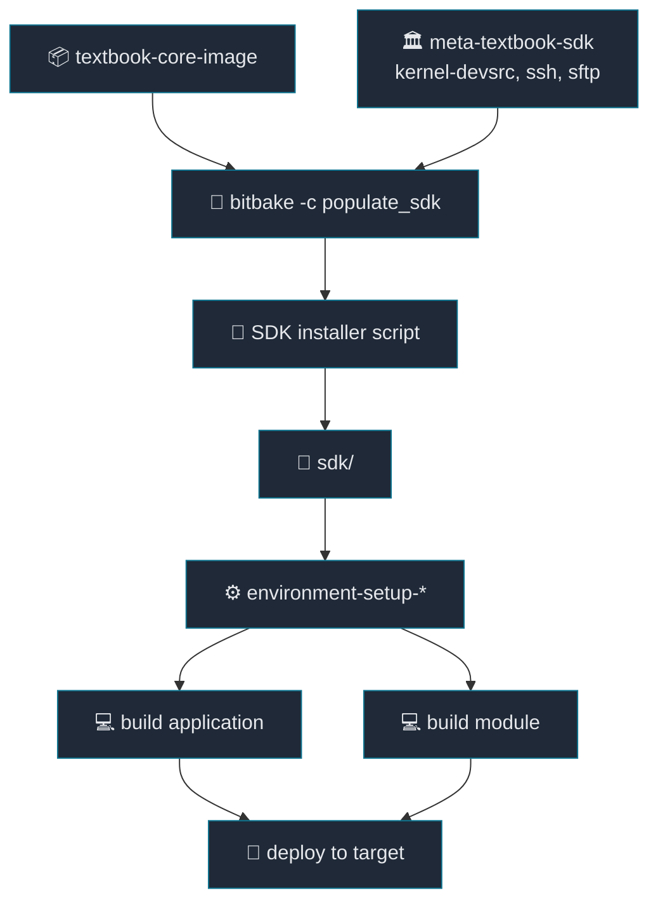

# 13. SDK Generation and SDK-Based Development

[Back to Learning Path](../README.md#learning-path)

Related Commit:

- `5baa5aa envsetup, meta-textbook-sdk: add SDK layer and automated installation helper`

## When to Use

Add the SDK layer and `populate_sdk` helper when developers need to build applications or out-of-tree kernel modules outside the Yocto build tree.

## What This Chapter Covers

This chapter explains the SDK workflow for creating an external development environment that matches the target image ABI. It covers `populate_sdk`, the SDK installer, `environment-setup-*`, and `kernel-devsrc`.

## Concept

An SDK, or Software Development Kit, is a tool bundle for building target binaries outside the full BitBake workspace. It includes the target cross compiler, sysroot, headers, libraries, pkg-config metadata, and an environment setup script.

The host that builds the Yocto image and the workstation used by an application developer are not always the same environment. With an SDK, the developer can source `environment-setup-*` and build target-compatible applications or out-of-tree kernel modules without understanding the whole BitBake build tree.

| Component | Description |
| --- | --- |
| cross compiler | Builds ARM64 target binaries from the x86_64 host. |
| target sysroot | Provides headers and libraries matching the target rootfs ABI. |
| `environment-setup-*` | Sets variables such as `CC`, `CXX`, `PKG_CONFIG_SYSROOT_DIR`, `ARCH`, and `CROSS_COMPILE`. |
| SDK installer | Installs the `populate_sdk` output onto a developer machine. |
| `kernel-devsrc` | Provides kernel source/header support for out-of-tree module builds. |

In short, the SDK is an external development environment aligned with the product image ABI. BitBake creates the reproducible image and package set; the SDK lets developers build separate source projects against that result.

## Required Additions

| Item | Description |
| --- | --- |
| SDK layer | Keeps SDK-related policy separate from the core image metadata. |
| image recipe `.bbappend` | Extends the image and SDK feature set. |
| `TOOLCHAIN_TARGET_TASK` | Adds target development packages to the SDK. |
| SSH/SFTP image feature | Provides runtime deployment support to the target. |
| SDK install helper | Automates `populate_sdk` and installer execution. |
| external example projects | Demonstrate SDK-based application and module builds. |

## Project Implementation

```text
.
├── envsetup.sh
├── external
│   ├── hello-sdk-application
│   └── hello-sdk-module
├── sdk
│   └── environment-setup-cortexa57-oe-linux
└── layers
    └── meta-textbook
        └── meta-textbook-sdk
            ├── conf/layer.conf
            └── appends/image/textbook-core-image.bbappend
```



| Step | Command/action | Result |
| --- | --- | --- |
| One-time setup | Run `bitbake -c populate_sdk`, then run the installer. | `sdk/environment-setup-*` is created. |
| Dev cycle | Source the SDK environment and build app/module source. | Target binaries are built outside the BitBake tree. |
| Deploy/test loop | Run `make install TARGET_IP=...`, then verify on target. | Output is tested against the matching image ABI. |

SDK layer:

```bitbake
TOOLCHAIN_TARGET_TASK:append = " kernel-devsrc"
EXTRA_IMAGE_FEATURES += "ssh-server-openssh"
IMAGE_INSTALL:append = " openssh-sftp-server"
```

Install helper:

```sh
install_sdk() {
    local sdk_dir=${WORKSPACE_BASE}/sdk
    local sdk_script=textbook-systemd-distro-glibc-x86_64-textbook-core-image-cortexa57-textbook-toolchain-1.0.0.sh

    mkdir -p ${sdk_dir}
    bitbake textbook-core-image -c populate_sdk
    ${WORKSPACE_BASE}/${BUILD_DIR}/tmp/deploy/sdk/${sdk_script} -y -d ${sdk_dir}
}
```

SDK environment:

```sh
export SDKTARGETSYSROOT=.../sdk/sysroots/cortexa57-oe-linux
export OECORE_TARGET_ARCH="aarch64"
export ARCH=arm64
export CROSS_COMPILE=aarch64-oe-linux-
export CC="aarch64-oe-linux-gcc ... --sysroot=$SDKTARGETSYSROOT"
```

## SDK Application Development

```sh
cd external/hello-sdk-application
source envsetup.sh
make
make install TARGET_IP=192.168.7.2
```

Core idea:

```make
CC ?= $(CROSS_COMPILE)gcc
$(CC) $(CFLAGS) -o $@ $^ $(LDFLAGS)
scp $< root@$(TARGET_IP):/home/root/
```

## SDK Kernel Module Development

```sh
cd external/hello-sdk-module
source envsetup.sh
make
make install TARGET_IP=192.168.7.2
```

Core idea:

```make
KERNEL_SRC ?= ${SDKTARGETSYSROOT}/usr/src/kernel
obj-m := $(TARGET).o

$(TARGET).ko: modules_prepare
	$(MAKE) -C $(KERNEL_SRC) M=$(SRC) modules
```

## Key Takeaway

BitBake produces the product image reproducibly. The SDK provides an external development environment that matches that image ABI. Because `kernel-devsrc` is included, this SDK supports both normal applications and out-of-tree kernel modules.

SDK and `devtool` solve different problems. SDK development happens outside the Yocto build tree. `devtool` works inside the Yocto workspace to modify recipes and turn source changes into patches or `.bbappend` files.

## Verification Commands

```sh
source envsetup.sh
install_sdk
source sdk/environment-setup-cortexa57-oe-linux
echo $CC
echo $SDKTARGETSYSROOT

cd external/hello-sdk-application
source envsetup.sh
make

cd ../hello-sdk-module
source envsetup.sh
make
```
