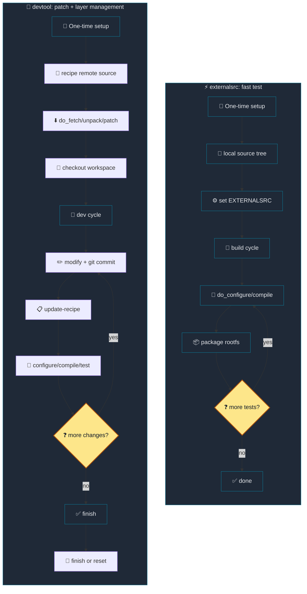

# 15. devtool — kernel workflow 우선 설명

[Back to Learning Path](../README.md#learning-path)

이 문서는 `devtool`을 사용해 **kernel source(예: `linux-textbook`)를 workspace로 꺼내 수정하고**, 변경을 recipe에 반영하는 실무 중심 흐름을 먼저 설명한다. 단계별 command, generated artifact, 주의사항과 troubleshooting을 간결하게 정리한다. 기타 `devtool` 기능(새 recipe 추가, deploy 등)은 appendix처럼 뒤에 다룬다.

## What This Chapter Covers

이 chapter는 source 수정과 recipe 반영을 하나의 workflow로 묶는 `devtool`의 역할을 설명한다. `devtool modify`로 source를 workspace에 꺼내고, commit을 기준으로 patch와 `.bbappend`를 생성해 layer에 남기는 과정을 `externalsrc`와 비교한다.

## 왜 devtool인가?

Yocto 개발에서는 단순히 source tree를 build하는 것과, 그 변경을 recipe/layer에 정식으로 반영하는 것이 분리되어 있다. kernel처럼 큰 source를 다룰 때는 다음 두 가지를 모두 만족해야 한다.

| 목표 | 설명 |
| --- | --- |
| Yocto build가 source를 올바르게 사용 | recipe가 준비한 source/sysroot/build 환경에서 수정 사항 검증 |
| 변경 내용을 layer에 기록 | patch, `.bbappend`, config fragment로 재현 가능한 artifact 생성 |

`devtool`은 이 두 가지를 함께 관리해 주는 tool이다. `devtool modify`로 workspace에 source를 꺼내고, `git commit`으로 change history를 만들고, `devtool update-recipe`나 `devtool finish`로 recipe에 반영하는 흐름이 명확하다.

## externalsrc 대신 devtool을 쓰는 이유

`externalsrc`는 이미 local에 존재하는 외부 source tree를 Yocto build에 곧바로 연결할 때 편리하다. 하지만 다음과 같은 경우에는 `devtool`이 더 적합하다.

- 최종적으로 변경 내용을 recipe에 반영해야 할 때
- patch, `.bbappend`, Kconfig fragment 같은 recipe artifact를 자동으로 생성하고 싶을 때
- Yocto build와 source change history를 함께 관리하며 반복적으로 테스트할 때

`externalsrc`는 외부 source를 직접 사용하기 때문에 빠른 테스트에는 좋지만, 이 과정에서 일반 recipe의 `do_fetch` / `do_unpack` / `do_patch` 단계가 생략되는 점을 반드시 알아야 한다. 즉, Yocto가 `fetch`한 remote archive나 git source를 준비하는 대신, 이미 준비된 local source tree를 곧바로 build 입력으로 쓰게 된다.

이로 인해 다음 항목이 생략되거나 수동화될 수 있다.

| 항목 | `externalsrc`에서의 상태 |
| --- | --- |
| fetch/unpack/patch 기반 source 준비 | local tree를 직접 사용하므로 생략 |
| workspace source 복사/관리 | 개발자가 직접 관리 |
| `git commit` 기반 patch 생성 | 수동 처리 필요 |
| `bbappend` / `devtool-fragment.cfg` 생성 | 자동 생성되지 않음 |
| `devtool finish`/`devtool reset` 정리 | 별도 수동 작업 필요 |

이 때문에 `externalsrc`를 쓰면 source 변경을 시험해볼 수는 있지만, 그 결과를 Yocto layer에 깔끔하게 기록하고 재현성을 유지하려면 별도의 수동 작업이 필요하다. 반면 `devtool`은 workspace source와 Yocto metadata를 함께 다루면서, 개발 결과물을 patch/recipe 형태로 정리할 수 있다.



**Workflow selection:**

| 상황 | devtool | externalsrc |
| --- | --- | --- |
| 빠르게 source를 build하고 테스트만 하고 싶음 | 오버헤드 있음 | 추천 |
| 변경을 최종적으로 layer에 반영하고 싶음 | 적합 | 별도 작업 필요 |
| patch를 자동으로 생성하고 싶음 | 자동 생성 | 수동 작업 필요 |
| 반복적으로 수정/테스트/반영하는 사이클 | 자동 정리 | 수동 정리 필요 |
| 재현성 있게 release 준비 | 적합 | 주의 필요 |

## Workflow Summary

| 단계 | command/작업 | 결과 |
| --- | --- | --- |
| 1 | `devtool create-workspace` + `bitbake-layers add-layer` | workspace layer 생성 |
| 2 | `devtool modify linux-textbook` | kernel source를 workspace로 checkout |
| 3 | `devshell` → `menuconfig` → `savedefconfig` | kernel config 변경과 테스트 |
| 4 | `git commit` | patch 생성 기준 commit 확보 |
| 5 | `devtool update-recipe -a <layer> linux-textbook` | `.bbappend`, fragment, patch 생성 |
| 6 | `bitbake linux-textbook -c compile` → `bitbake linux-textbook` | build 검증 |
| 7 | `devtool finish` 또는 `devtool reset` | 정식 반영 또는 되돌리기 |

아래에서 각 단계에 대한 구체 command와 generated files를 정리한다.

## 1) 준비 및 workspace 생성

```sh
source envsetup.sh
devtool create-workspace ../workspace
bitbake-layers add-layer ../workspace
```

설명: `source envsetup.sh` 이후 현재 directory는 `build/`다. 위 command는 workspace root의 `workspace/` directory를 devtool workspace layer로 사용한다(`appends/`, `recipes/`, `sources/`). 한 번만 만들면 된다.

## 2) kernel을 workspace로 꺼내기

```sh
devtool modify linux-textbook
devtool status
```

결과: workspace root 기준 `workspace/sources/linux-textbook`에 복사된 source tree가 생성된다. 이 복사본에서 수정 작업을 진행한다.

## 3) devshell에서 구성 변경 및 테스트 build

```sh
bitbake linux-textbook -c devshell
# devshell 내에서
make menuconfig
make savedefconfig
```

설명: `menuconfig`로 새로운 Kconfig 항목을 켜거나 변경한 뒤 `savedefconfig`로 저장한다. 모듈 추가/간단 드라이버 작성은 여기서 수행한다.

## 4) 변경 사항 commit (중요)

```sh
cd ../workspace/sources/linux-textbook
git add drivers/misc/Kconfig drivers/misc/Makefile drivers/misc/textbook_devtool_test.c
git commit -m "misc: add textbook devtool test driver"
```

이유: `devtool update-recipe`는 workspace의 commit을 바탕으로 patch와 bbappend를 생성하므로, commit을 반드시 만들어야 한다.

## 5) recipe 업데이트 및 patch 생성

```sh
devtool update-recipe -a ../layers/meta-textbook/meta-textbook-core-bsp linux-textbook
```

생성되는 예시 artifact:

```text
.
└── layers
    └── meta-textbook
        └── meta-textbook-core-bsp
            └── recipes-linux/linux
                ├── linux-textbook.bbappend
                └── linux-textbook
                    ├── devtool-fragment.cfg
                    └── 0001-misc-add-test-driver-for-devtool-modify-workflow-ver.patch
```

| artifact | Description |
| --- | --- |
| `linux-textbook.bbappend` | `SRC_URI`, `FILESEXTRAPATHS` 등 recipe 확장 |
| `devtool-fragment.cfg` | `CONFIG_TEXTBOOK_DEVTOOL_TEST=y` 같은 Kconfig 변경 |
| `0001-*.patch` | 실제 kernel source 변경 patch |

설명: 위 file들을 검토해 `SRC_URI`와 patch 내용이 의도한 대로 되어있는지 확인한 후 layer에 commit한다.

## 6) build 확인

```sh
bitbake linux-textbook -c compile
bitbake linux-textbook
```

문제가 발생하면 관련 로그(예: `tmp/work/.../temp/log.do_packagedata.*`)를 확인한다.

## 7) finish 또는 reset

정식으로 layer에 반영하려면:

```sh
devtool finish linux-textbook ../layers/meta-textbook/meta-textbook-core-bsp
```

변경을 취소하고 workspace를 제거하려면:

```sh
devtool reset linux-textbook
rm -rf ../workspace/sources/linux-textbook
bitbake-layers remove-layer ../workspace
```

## generated files

| 위치 | 내용 |
| --- | --- |
| `workspace/sources/linux-textbook/` | 수정한 kernel source |
| `layers/.../linux-textbook.bbappend` | `FILESEXTRAPATHS` 및 `SRC_URI` 추가 |
| `layers/.../devtool-fragment.cfg` | devtool로 만든 Kconfig fragment |
| `layers/.../0001-*.patch` | source 변경 patch |

## troubleshooting — common kernel devtool errors

1) "The source tree is not clean, please run 'make mrproper'"

  - 원인: devshell에서 생성된 build artifact나 변경이 source tree를 더럽혀 build가 실패.
  - 해결:

```sh
cd ../workspace/sources/linux-textbook
make mrproper
git reset --hard HEAD   # 로컬 변경을 모두 되돌릴 때만 사용
git clean -fdx
```

2) QA error: "Package version ... went backwards" (`version-going-backwards`)

  - 원인: 이전 build에서 생성된 package 버전 표기가 현재보다 높아 Yocto QA에 걸림.
  - 권장 해결:

```sh
cd build
rm -rf tmp/work/textbook-oe-linux/linux-textbook/
rm -rf sstate-cache/*linux-textbook*
bitbake linux-textbook
```

  - 임시 우회(권장하지 않음):

```sh
echo 'ERROR_QA:remove = "version-going-backwards"' >> conf/local.conf
```

3) `pkgdata` error: "tar: ... pkgdata: Cannot open: No such file or directory"

  - 원인: `do_package`/`do_packagedata` 단계의 중간 artifact 누락.
  - 해결:

```sh
bitbake -c cleansstate linux-textbook
bitbake linux-textbook
```

  - 필요시 `tmp/work/.../linux-textbook` directory를 삭제 후 재시도.

## Appendix: 기타 devtool 기능

| 기능 | command | 비고 |
| --- | --- | --- |
| 새 recipe 추가 | `devtool add <name> <source>` | local 또는 remote source |
| recipe build | `devtool build <recipe>` | workspace recipe build |
| image build | `devtool build-image <image>` | devtool workspace 반영 image build |
| target deploy | `devtool deploy-target <recipe> <user@host>` | file copy 방식, dependency 설치 없음 |
| reset work | `devtool reset <recipe>` | workspace recipe 연결 해제 |

## checklist (kernel 수정 시)

- [ ] `devtool modify` → `workspace/sources/<recipe>` 생성 확인
- [ ] `devshell`에서 변경 후 반드시 `git commit` 수행
- [ ] `devtool update-recipe -a <layer> <recipe>` 실행, 생성된 `.bbappend`와 patch 검토
- [ ] `bitbake -c compile <recipe>`로 compile 확인
- [ ] QA error(버전 등) 발생 시 `tmp/work`·`sstate-cache` 정리
