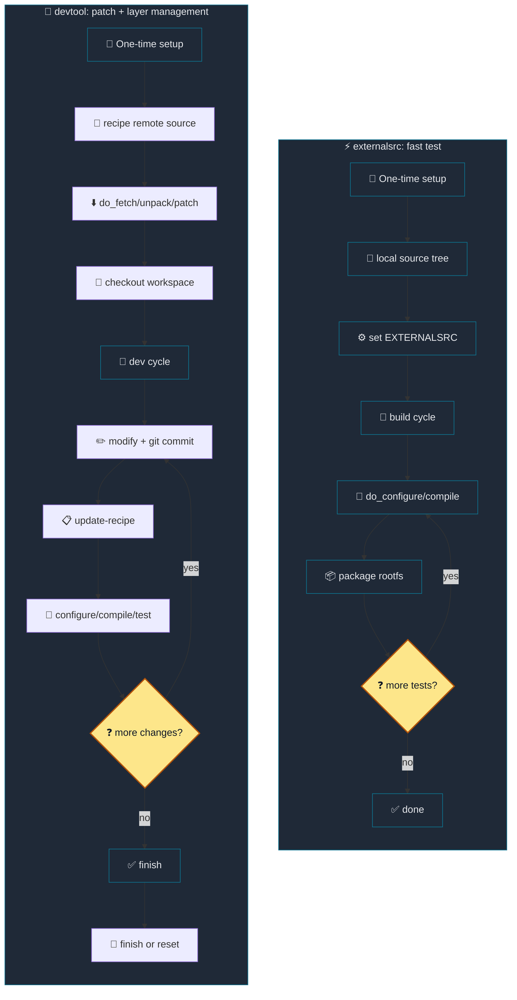

# 15. devtool Kernel Workflow

[Back to Learning Path](../README.md#learning-path)

This chapter focuses first on a practical kernel workflow: using `devtool` to check out a recipe source tree into a workspace, edit it, and turn the result back into recipe metadata.

## What This Chapter Covers

`devtool` connects source changes and recipe changes. `devtool modify` creates a workspace source tree, local commits become the basis for patches, and `devtool update-recipe` or `devtool finish` writes the result into a layer. This chapter also compares that workflow with `externalsrc`.

## Why devtool?

Yocto development has two related but different tasks:

| Goal | Description |
| --- | --- |
| Build and test source with Yocto | Validate changes using the recipe's source, sysroot, and build environment. |
| Record the change in a layer | Generate reproducible artifacts such as patches, `.bbappend` files, and config fragments. |

`devtool` manages those tasks together. It checks out source into a workspace, lets you make Git commits, and then converts those commits into recipe artifacts.

## devtool vs externalsrc

`externalsrc` is useful when a project already has a local source tree and you want Yocto to build it directly. `devtool` is better when the final output must become recipe metadata.

Use `devtool` when:

- The change must be recorded in a layer.
- You want patches, `.bbappend` files, or Kconfig fragments generated from the workspace.
- You want an edit/build/update loop that stays connected to the recipe.

`externalsrc` skips parts of the normal `do_fetch`, `do_unpack`, and `do_patch` path because it uses an already-prepared local tree. That is fast, but it also means patch generation and cleanup are manual. `devtool` keeps those steps organized.



| Situation | devtool | externalsrc |
| --- | --- | --- |
| Fast local source build/test only | More overhead | Best fit |
| Final layer integration | Best fit | Manual work required |
| Automatic patch generation | Supported | Manual |
| Repeated edit/test/update cycle | Managed workflow | Manual cleanup |
| Release-ready reproducibility | Good fit | Use carefully |

## Workflow Summary

| Step | Command/action | Result |
| --- | --- | --- |
| 1 | `devtool create-workspace` + `bitbake-layers add-layer` | Creates a workspace layer. |
| 2 | `devtool modify linux-textbook` | Checks out kernel source into the workspace. |
| 3 | `devshell` -> `menuconfig` -> `savedefconfig` | Changes and tests kernel config. |
| 4 | `git commit` | Creates commits that can become patches. |
| 5 | `devtool update-recipe -a <layer> linux-textbook` | Generates `.bbappend`, fragment, and patch files. |
| 6 | `bitbake linux-textbook -c compile` -> `bitbake linux-textbook` | Verifies the build. |
| 7 | `devtool finish` or `devtool reset` | Integrates or discards the workspace changes. |

## 1. Prepare the Workspace

```sh
source envsetup.sh
devtool create-workspace ../workspace
bitbake-layers add-layer ../workspace
```

After `source envsetup.sh`, the current directory is `build/`. The command above uses the workspace root's `workspace/` directory as the devtool workspace layer.

## 2. Check Out the Kernel Source

```sh
devtool modify linux-textbook
devtool status
```

The source appears under `workspace/sources/linux-textbook` relative to the workspace root.

## 3. Change Configuration and Test in devshell

```sh
bitbake linux-textbook -c devshell
# inside devshell
make menuconfig
make savedefconfig
```

Use this step for Kconfig changes, small driver edits, and direct build checks inside the recipe environment.

## 4. Commit the Workspace Change

```sh
cd ../workspace/sources/linux-textbook
git add drivers/misc/Kconfig drivers/misc/Makefile drivers/misc/textbook_devtool_test.c
git commit -m "misc: add textbook devtool test driver"
```

`devtool update-recipe` uses workspace commits to generate patches. Make at least one commit before updating the recipe.

## 5. Update the Recipe

```sh
devtool update-recipe -a ../layers/meta-textbook/meta-textbook-core-bsp linux-textbook
```

Generated artifact example:

```text
.
└── layers
    └── meta-textbook
        └── meta-textbook-core-bsp
            └── recipes-linux/linux
                ├── linux-textbook.bbappend
                └── linux-textbook
                    ├── devtool-fragment.cfg
                    └── 0001-misc-add-test-driver-for-devtool-modify-workflow-ver.patch
```

| Artifact | Description |
| --- | --- |
| `linux-textbook.bbappend` | Extends `SRC_URI`, `FILESEXTRAPATHS`, and related recipe metadata. |
| `devtool-fragment.cfg` | Stores Kconfig changes such as `CONFIG_TEXTBOOK_DEVTOOL_TEST=y`. |
| `0001-*.patch` | Stores source changes from the workspace commit. |

Review the generated files before committing them to the layer.

## 6. Verify the Build

```sh
bitbake linux-textbook -c compile
bitbake linux-textbook
```

If a task fails, inspect logs such as `tmp/work/.../temp/log.do_packagedata.*`.

## 7. Finish or Reset

To integrate the change:

```sh
devtool finish linux-textbook ../layers/meta-textbook/meta-textbook-core-bsp
```

To discard the workspace connection:

```sh
devtool reset linux-textbook
rm -rf ../workspace/sources/linux-textbook
bitbake-layers remove-layer ../workspace
```

## Generated Files

| Location | Description |
| --- | --- |
| `workspace/sources/linux-textbook/` | Edited kernel source tree. |
| `layers/.../linux-textbook.bbappend` | Recipe extension generated by devtool. |
| `layers/.../devtool-fragment.cfg` | Kconfig fragment generated by devtool. |
| `layers/.../0001-*.patch` | Source patch generated from the workspace commit. |

## Troubleshooting

### Source tree is not clean

Cause: build artifacts or uncommitted changes left the workspace source tree dirty.

```sh
cd ../workspace/sources/linux-textbook
make mrproper
git reset --hard HEAD   # use only when you intentionally discard all local changes
git clean -fdx
```

### Package version went backwards

Cause: the previous package version recorded by the build is higher than the current one.

Recommended cleanup:

```sh
cd build
rm -rf tmp/work/textbook-oe-linux/linux-textbook/
rm -rf sstate-cache/*linux-textbook*
bitbake linux-textbook
```

Temporary workaround, not recommended for normal use:

```sh
echo 'ERROR_QA:remove = "version-going-backwards"' >> conf/local.conf
```

### pkgdata file is missing

Cause: an intermediate `do_package` or `do_packagedata` artifact is missing.

```sh
bitbake -c cleansstate linux-textbook
bitbake linux-textbook
```

If needed, remove the related `tmp/work/.../linux-textbook` directory and retry.

## Appendix: Other devtool Commands

| Feature | Command | Note |
| --- | --- | --- |
| Add a recipe | `devtool add <name> <source>` | Local or remote source. |
| Build a recipe | `devtool build <recipe>` | Builds the workspace recipe. |
| Build an image | `devtool build-image <image>` | Builds the image with workspace changes. |
| Deploy to target | `devtool deploy-target <recipe> <user@host>` | Copies files; it does not install dependencies. |
| Reset work | `devtool reset <recipe>` | Disconnects the workspace recipe. |

## Checklist

- [ ] `devtool modify` created `workspace/sources/<recipe>`.
- [ ] Source changes were committed in the workspace Git tree.
- [ ] `devtool update-recipe -a <layer> <recipe>` generated expected `.bbappend` and patch files.
- [ ] `bitbake -c compile <recipe>` passed.
- [ ] QA issues, version warnings, and stale workdirs were checked if the build failed.
