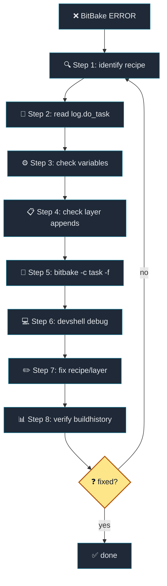

# 16. Yocto 사용 FAQ와 debugging reference

[Back to Learning Path](../README.md#learning-path)

## FAQ Index

Yocto를 실제로 사용하다 보면 다음 질문이 바로 생긴다.

| 질문 | 이 장의 위치 |
| --- | --- |
| 대표적인 기본 variable은 무엇인가 | `Common Variables` |
| error가 발생하면 어디부터 봐야 하는가 | `error가 발생했을 때 기본 루틴` |
| buildhistory는 무엇이고 어디에 남는가 | `buildhistory란 무엇인가` |
| layer는 어떻게 추가/제거하는가 | `Layer 추가와 제거` |
| variable과 recipe의 최종 형태는 어떻게 확인하는가 | `variable 최종값 확인`, `Recipe 최종 형태 확인` |
| `.bbappend`가 적용됐는지, 어떤 recipe가 선택됐는가 | `Recipe 최종 형태 확인` |

이 장은 후반부의 “실전 운영 레퍼런스”로 사용한다.

## What This Chapter Covers

이 chapter는 Yocto build가 실패했을 때 어디서부터 확인해야 하는지 순서를 잡아준다. recipe/task 이름, `log.do_*`, `run.do_*`, final variable, `.bbappend` 적용 여부, buildhistory를 차례로 확인해 감으로 수정하지 않고 현재 metadata 상태를 기준으로 debugging하는 방법을 정리한다.



**Debug process:**

| Debug Phase | 범위 | 목적 |
| --- | --- | --- |
| Gather info | Step 1-4 | recipe/task, log, variable, append 적용 여부로 원인 후보 좁히기 |
| Reproduce & fix | Step 5-7 | task 재실행, devshell 재현, recipe/layer 수정 |
| Verify | Step 8 | buildhistory로 image/package 변화 확인 |
| Iterate | fixed? no | 해결되지 않으면 Step 1로 돌아가 다시 좁히기 |

## Common Variables

### Build/workspace variable

| variable | Description | 예시/비고 |
| --- | --- | --- |
| `TOPDIR` | 현재 build directory | 보통 `build` |
| `COREBASE` | Poky/OE-Core 기준 경로 | 이 프로젝트에서는 `poky` |
| `TMPDIR` | 대부분의 build 작업이 생기는 곳 | `${TOPDIR}/tmp` |
| `DL_DIR` | fetch한 source cache | `${TOPDIR}/downloads` 또는 mirror |
| `SSTATE_DIR` | shared state cache | `${TOPDIR}/sstate-cache` |
| `DEPLOY_DIR` | deploy output root | `${TMPDIR}/deploy` |
| `DEPLOY_DIR_IMAGE` | kernel/image output 위치 | `${TMPDIR}/deploy/images/${MACHINE}` |
| `BUILDHISTORY_DIR` | buildhistory 출력 위치 | 이 프로젝트는 `${TOPDIR}/buildhistory` |

확인:

```sh
bitbake-getvar TOPDIR
bitbake-getvar COREBASE
bitbake-getvar TMPDIR
bitbake-getvar DEPLOY_DIR_IMAGE
```

### Recipe Work Directory Variables

| variable | Description |
| --- | --- |
| `WORKDIR` | recipe 하나의 workspace |
| `S` | source directory |
| `B` | build directory |
| `D` | install staging directory |
| `T` | task log/script가 있는 temp directory |

확인:

```sh
bitbake-getvar -r hello-makefile-application WORKDIR
bitbake-getvar -r hello-makefile-application S
bitbake-getvar -r hello-makefile-application B
bitbake-getvar -r hello-makefile-application D
```

### Recipe metadata variable

| variable | Description |
| --- | --- |
| `PN` | package/recipe base name |
| `PV` | version |
| `PR` | package revision |
| `PE` | epoch |
| `SUMMARY` | 짧은 설명 |
| `DESCRIPTION` | 긴 설명 |
| `LICENSE` | license |
| `LIC_FILES_CHKSUM` | license file checksum |
| `SRC_URI` | source, patch, local file 목록 |
| `SRCREV` | Git revision |
| `FILESPATH` | `file://` 검색 경로 |
| `FILESEXTRAPATHS` | layer에서 `FILESPATH` 확장 |

확인:

```sh
bitbake-getvar -r linux-textbook SRC_URI
bitbake-getvar -r linux-textbook PV
bitbake-getvar -r linux-textbook FILESPATH
```

### Dependency variable

| variable | Description |
| --- | --- |
| `DEPENDS` | build-time dependency |
| `RDEPENDS:${PN}` | runtime dependency |
| `RRECOMMENDS:${PN}` | 권장 runtime package |
| `PROVIDES` | build provider alias |
| `RPROVIDES:${PN}` | runtime provider alias |
| `PREFERRED_PROVIDER_virtual/kernel` | `virtual/kernel` provider 선택 |

예:

```bitbake
DEPENDS = "hello-cmake-library"
RDEPENDS:${PN} += "textbook-profile-service"
PREFERRED_PROVIDER_virtual/kernel = "linux-textbook"
```

### Machine/distro/image variable

| variable | Description |
| --- | --- |
| `MACHINE` | target machine |
| `MACHINE_FEATURES` | machine capability |
| `DISTRO` | distro policy |
| `DISTRO_FEATURES` | distro feature set |
| `IMAGE_INSTALL` | image에 설치할 package 목록 |
| `IMAGE_FEATURES` | image feature |
| `EXTRA_IMAGE_FEATURES` | 추가 image feature |
| `IMAGE_FSTYPES` | 생성할 image format |
| `PACKAGE_CLASSES` | rpm/ipk/deb package backend |

확인:

```sh
bitbake-getvar MACHINE
bitbake-getvar DISTRO
bitbake-getvar DISTRO_FEATURES
bitbake-getvar -r textbook-core-image IMAGE_INSTALL
bitbake-getvar -r textbook-core-image IMAGE_FSTYPES
```

### Layer variable

| variable | Description |
| --- | --- |
| `BBLAYERS` | 활성화된 layer 목록 |
| `BBPATH` | conf/class 검색 경로 |
| `BBFILES` | recipe 검색 pattern |
| `BBFILE_COLLECTIONS` | layer collection 이름 |
| `BBFILE_PRIORITY_*` | layer 우선순위 |
| `LAYERDEPENDS_*` | layer dependency |
| `LAYERSERIES_COMPAT_*` | 호환 Yocto release |

확인:

```sh
bitbake-getvar BBLAYERS
bitbake-layers show-layers
```

## variable 최종값 확인

단일 variable은 `bitbake-getvar`가 가장 읽기 쉽다.

```sh
bitbake-getvar MACHINE
bitbake-getvar DISTRO
bitbake-getvar -r linux-textbook SRC_URI
bitbake-getvar -r textbook-core-image IMAGE_INSTALL
```

전체 metadata dump가 필요하면 `bitbake -e`를 쓴다.

```sh
bitbake -e linux-textbook > /tmp/linux-textbook.env
grep '^SRC_URI=' /tmp/linux-textbook.env
grep '^do_compile' /tmp/linux-textbook.env
```

variable의 override까지 보고 싶을 때는 recipe를 지정해서 확인한다.

```sh
bitbake -e textbook-core-image | grep '^IMAGE_INSTALL='
bitbake -e packagegroup-textbook-core | grep '^RDEPENDS'
```

주의:

| tool | 적합한 상황 | 주의점 |
| --- | --- | --- |
| `bitbake-getvar` | 단일 variable 값을 빠르게 확인 | recipe별 값은 `-r <recipe>` 사용 |
| `bitbake -e` | 전체 metadata와 task function 분석 | 출력이 매우 크므로 grep/file redirect 권장 |

## Recipe 최종 형태 확인

어떤 recipe가 있는지:

```sh
bitbake-layers show-recipes
bitbake-layers show-recipes hello-makefile-application
bitbake-layers show-recipes virtual/kernel
```

어떤 `.bbappend`가 적용되는지:

```sh
bitbake-layers show-appends
bitbake-layers show-appends | grep linux-textbook
bitbake-layers show-appends | grep packagegroup-textbook-core
```

같은 recipe가 여러 layer에 있을 때 어떤 것이 가려지는지:

```sh
bitbake-layers show-overlayed
```

layer 간 dependency:

```sh
bitbake-layers show-cross-depends
```

사용 가능한 machine:

```sh
bitbake-layers show-machines
```

사용 가능한 layer:

```sh
bitbake-layers show-layers
```

## Layer 추가와 제거

현재 활성 layer 확인:

```sh
bitbake-layers show-layers
```

layer 추가:

```sh
bitbake-layers add-layer ../layers/meta-textbook/meta-textbook-external
```

layer 제거:

```sh
bitbake-layers remove-layer ../layers/meta-textbook/meta-textbook-external
```

이 프로젝트의 helper:

```sh
source envsetup.sh
add_external_sources
remove_external_sources
```

`remove_external_sources`는 `${TOPDIR}/conf/bblayers.conf`에서 external layer를 제거한다. `.repo/local_manifests/external.xml`과 `external/` checkout은 삭제하지 않는다.

직접 파일로 확인:

```sh
sed -n '1,160p' conf/bblayers.conf
```

주의:

| 주의점 | 설명 |
| --- | --- |
| `add-layer`는 `BBLAYERS` 수정 | `${TOPDIR}/conf/bblayers.conf`가 직접 바뀐다. |
| `TEMPLATECONF`는 새 build directory용 | 이미 만들어진 `${TOPDIR}/conf/bblayers.conf`는 별도로 수정해야 한다. |
| recipe가 안 보일 때 | `conf/layer.conf`, `BBFILES`, `LAYERSERIES_COMPAT`를 확인한다. |

## error가 발생했을 때 기본 루틴

| 순서 | 확인할 것 | 대표 command/위치 |
| --- | --- | --- |
| 1 | 실패한 recipe와 task 이름 | `ERROR: <recipe> ... do_<task>` |
| 2 | task log | `${WORKDIR}/temp/log.do_<task>` |
| 3 | 실제 실행 script | `${WORKDIR}/temp/run.do_<task>*` |
| 4 | 해당 task 강제 재실행 | `bitbake <recipe> -c <task> -f` |
| 5 | 같은 환경에서 수동 재현 | `bitbake <recipe> -c devshell` |

1. 실패한 task 이름을 확인한다.

예:

```text
ERROR: hello-makefile-application-1.0-r0 do_compile: ExecutionError
```

여기서 recipe는 `hello-makefile-application`, 실패 task는 `do_compile`이다.

2. log 파일을 연다.

```sh
bitbake-getvar -r hello-makefile-application T
ls $(bitbake-getvar -r hello-makefile-application --value T)
```

직접 찾기:

```sh
find tmp/work -path '*hello-makefile-application*' -path '*temp/log.do_compile*'
```

대표 로그:

```text
${WORKDIR}/temp/log.do_fetch
${WORKDIR}/temp/log.do_patch
${WORKDIR}/temp/log.do_configure
${WORKDIR}/temp/log.do_compile
${WORKDIR}/temp/log.do_install
${WORKDIR}/temp/log.do_package
${WORKDIR}/temp/log.do_rootfs
```

3. 실제 실행 script를 본다.

```sh
ls ${WORKDIR}/temp/run.do_compile*
```

`run.do_*` 파일은 BitBake가 실제로 실행한 shell script다. 로그만으로 부족하면 이 파일에서 어떤 command가 어떤 환경으로 실행됐는지 본다.

4. 해당 task만 강제로 다시 실행한다.

```sh
bitbake hello-makefile-application -c compile -f
```

5. devshell로 들어가 같은 환경에서 재현한다.

```sh
bitbake hello-makefile-application -c devshell
```

devshell 안:

```sh
echo $CC
echo $S
echo $B
oe_runmake -C ${S} O=${B}
```

## task별 자주 보는 원인

| 실패 task | 자주 보는 원인 | 확인할 것 |
| --- | --- | --- |
| `do_fetch` | URL error, branch error, 네트워크, checksum mismatch | `SRC_URI`, `SRCREV`, `DL_DIR`, mirror |
| `do_unpack` | archive 형식 문제, source directory 예상 불일치 | `S`, unpack 결과 |
| `do_patch` | patch context mismatch, patch 순서 문제 | `SRC_URI` patch 순서, `log.do_patch` |
| `do_configure` | dependency 누락, CMake/autotools 옵션 error | `DEPENDS`, `EXTRA_OECMAKE`, `PACKAGECONFIG` |
| `do_compile` | cross compile 옵션 누락, header/library 누락 | `CC`, `CFLAGS`, `DEPENDS`, sysroot |
| `do_install` | 잘못된 install path, `${D}` 미사용 | `install -d ${D}${bindir}` 형태 |
| `do_package` | `FILES` 누락, split package error | `FILES:${PN}`, `PACKAGES` |
| `do_package_qa` | rpath, already-stripped, dev-so, installed-vs-shipped | QA 메시지, `FILES`, build flags |
| `do_rootfs` | runtime dependency 미해결, package conflict | `RDEPENDS`, `IMAGE_INSTALL`, packagegroup |
| `do_image` | image size, filesystem tool 문제 | `IMAGE_ROOTFS_SIZE`, `IMAGE_FSTYPES` |

## clean 계열 command

| command | 지우는 범위 | 사용 상황 |
| --- | --- | --- |
| `bitbake hello-makefile-application -c clean` | recipe work output | compile/install/package artifact를 다시 만들고 싶을 때 |
| `bitbake hello-makefile-application -c cleansstate` | recipe work output + sstate | cache 영향 없이 다시 build하고 싶을 때 |
| `bitbake hello-makefile-application -c cleanall` | work output + sstate + download | fetch/source 문제까지 다시 확인할 때 |

주의:

| 주의점 | 설명 |
| --- | --- |
| `cleanall`은 source download까지 삭제 | mirror/download 재사용도 사라진다. |
| 일반적인 rebuild에는 과할 수 있음 | fetch 문제가 아니라면 보통 `clean` 또는 `cleansstate`로 충분하다. |

## buildhistory란 무엇인가

buildhistory는 build 결과의 변화 기록이다.

이 프로젝트 configuration:

```bitbake
INHERIT += "buildhistory"
BUILDHISTORY_COMMIT = "1"
BUILDHISTORY_COMMIT_AUTHOR = "JunKi Hong <dylanhong920509@gmail.com>"
BUILDHISTORY_DIR = "${TOPDIR}/buildhistory"
BUILDHISTORY_IMAGE_FILES = "/etc/passwd /etc/group"
```

남는 정보:

| 기록 | 확인 목적 |
| --- | --- |
| image에 설치된 package 목록 | package 추가/삭제 확인 |
| package version과 size | version 변경, size 증가 추적 |
| image info | image 설정과 build 결과 확인 |
| dependency graph | package dependency 변화 확인 |
| 특정 image file 내용 | `/etc/passwd`, `/etc/group` 같은 감시 대상 확인 |
| metadata revision | build에 사용된 layer commit 추적 |

이 프로젝트에서 확인한 파일:

```text
.
└── build
    └── buildhistory
        ├── metadata-revs
        └── images/textbook/glibc/textbook-core-image
            ├── image-info.txt
            ├── installed-package-names.txt
            └── files-in-image.txt
```

확인:

```sh
git -C buildhistory log --oneline -n 10
sed -n '1,120p' buildhistory/images/textbook/glibc/textbook-core-image/image-info.txt
grep hello buildhistory/images/textbook/glibc/textbook-core-image/installed-package-names.txt
```

build 간 차이 확인:

```sh
git -C buildhistory diff HEAD~1 HEAD
buildhistory-diff buildhistory
```

Key Takeaway:

buildhistory는 “image에 무엇이 들어갔는지”와 “지난 build 이후 무엇이 바뀌었는지”를 추적하는 기록이다. 제품 개발에서는 image 크기 증가, package 추가/삭제, version 변경을 확인하는 데 중요하다.

## source, patch, file 검색 문제 확인

`file://`이 어디서 검색되는지:

```sh
bitbake-getvar -r linux-textbook FILESPATH
```

`FILESEXTRAPATHS`가 제대로 들어갔는지:

```sh
bitbake-getvar -r linux-textbook FILESEXTRAPATHS
```

source fetch 정보:

```sh
bitbake-getvar -r hello-cmake-application SRC_URI
bitbake-getvar -r hello-cmake-application SRCREV
```

## package 내용 확인

설치 staging directory 확인:

```sh
bitbake-getvar -r hello-makefile-application D
```

package split 결과는 buildhistory나 pkgdata로 확인한다.

```sh
oe-pkgdata-util list-pkgs | grep hello
oe-pkgdata-util list-pkg-files hello-makefile-application
oe-pkgdata-util find-path /usr/bin/hello-makefile-application
```

image에 실제로 들어갔는지:

```sh
grep hello-makefile-application buildhistory/images/textbook/glibc/textbook-core-image/installed-package-names.txt
```

## provider 문제 확인

`virtual/kernel`처럼 provider가 여러 개일 수 있는 항목은 provider 선택을 확인한다.

```sh
bitbake-getvar PREFERRED_PROVIDER_virtual/kernel
bitbake-layers show-recipes virtual/kernel
```

이 프로젝트:

```bitbake
PREFERRED_PROVIDER_virtual/kernel = "linux-textbook"
```

## override 확인

Yocto variable은 override로 machine, distro, package별 값을 바꿀 수 있다.

예:

```bitbake
RDEPENDS:${PN} += "textbook-profile-service"
IMAGE_ROOTFS_EXTRA_SPACE:append = " + 4096"
PACKAGECONFIG:append:pn-qemu-system-native = " sdl"
```

최종값 확인:

```sh
bitbake-getvar -r textbook-core-image IMAGE_ROOTFS_EXTRA_SPACE
bitbake-getvar -r packagegroup-textbook-core RDEPENDS
```

## dependency graph 확인

전체 image graph:

```sh
bitbake textbook-core-image -g
```

generated files:

```text
pn-buildlist
recipe-depends.dot
task-depends.dot
```

특정 recipe가 왜 build되는지 볼 때 유용하다.

## 실전 debugging 순서 요약

| 순서 | 작업 | 목적 |
| --- | --- | --- |
| 1 | ERROR에서 recipe와 task 이름 확인 | 실패 지점 특정 |
| 2 | `${WORKDIR}/temp/log.do_<task>` 읽기 | 직접 원인 확인 |
| 3 | `bitbake-getvar -r <recipe>`로 `S/B/D/WORKDIR/SRC_URI/DEPENDS` 확인 | metadata 최종값 검증 |
| 4 | `bitbake-layers show-appends` 확인 | `.bbappend` 적용 여부 확인 |
| 5 | 필요한 task만 `-f`로 재실행 | 빠른 재현 |
| 6 | devshell에서 수동 재현 | 같은 build 환경에서 원인 좁히기 |
| 7 | recipe/layer metadata에 반영 | 재현 가능한 수정으로 고정 |
| 8 | buildhistory 확인 | image/package 변화 검증 |

## Key Takeaway

Yocto debugging의 핵심은 “최종 metadata를 확인하고, 실패한 task의 log/run script를 읽고, 필요하면 같은 환경에 들어가 재현하는 것”이다. 감으로 고치기보다 `bitbake-getvar`, `bitbake -e`, `bitbake-layers`, `buildhistory`를 사용해 현재 build 시스템이 무엇을 보고 있는지 먼저 확인한다.
