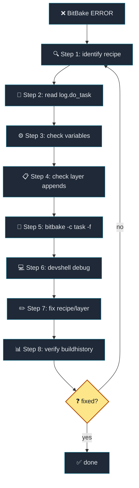

# 16. Yocto FAQ and Debugging Reference

[Back to Learning Path](../README.md#learning-path)

## FAQ Index

Use this chapter as a practical reference when a Yocto build fails or when you need to inspect the current metadata state.

| Question | Section |
| --- | --- |
| Which basic variables should I know first? | `Common Variables` |
| Where should I start when an error occurs? | `Basic Error Routine` |
| What is buildhistory and where is it written? | `buildhistory` |
| How do I add or remove layers? | `Adding and Removing Layers` |
| How do I check final variable and recipe state? | `Checking Final Variables`, `Checking Final Recipe State` |
| How do I know whether a `.bbappend` was applied? | `Checking Final Recipe State` |

## What This Chapter Covers

This chapter gives a debugging order for Yocto builds. Start with the recipe and task name, then inspect `log.do_*`, `run.do_*`, final variables, applied `.bbappend` files, and buildhistory. The goal is to debug from the metadata that BitBake is actually using, not from guesses.



| Debug Phase | Scope | Goal |
| --- | --- | --- |
| Gather information | Step 1-4 | Narrow the cause with recipe/task, logs, variables, and appends. |
| Reproduce and fix | Step 5-7 | Re-run tasks, reproduce in devshell, and edit recipe/layer metadata. |
| Verify | Step 8 | Check package and image changes through buildhistory. |
| Iterate | fixed? no | Return to Step 1 with better information. |

## Common Variables

### Build and Workspace Variables

| Variable | Description | Example/note |
| --- | --- | --- |
| `TOPDIR` | Current build directory. | Usually `build`. |
| `COREBASE` | Poky/OE-Core base path. | `poky` in this project. |
| `TMPDIR` | Main build output directory. | `${TOPDIR}/tmp` |
| `DL_DIR` | Fetched source cache. | `${TOPDIR}/downloads` or a mirror. |
| `SSTATE_DIR` | Shared state cache. | `${TOPDIR}/sstate-cache` |
| `DEPLOY_DIR` | Deploy output root. | `${TMPDIR}/deploy` |
| `DEPLOY_DIR_IMAGE` | Kernel and image output directory. | `${TMPDIR}/deploy/images/${MACHINE}` |
| `BUILDHISTORY_DIR` | buildhistory output directory. | `${TOPDIR}/buildhistory` in this project. |

```sh
bitbake-getvar TOPDIR
bitbake-getvar COREBASE
bitbake-getvar TMPDIR
bitbake-getvar DEPLOY_DIR_IMAGE
```

### Recipe Work Directory Variables

| Variable | Description |
| --- | --- |
| `WORKDIR` | Work directory for one recipe. |
| `S` | Source directory. |
| `B` | Build directory. |
| `D` | Install staging directory. |
| `T` | Temporary directory that contains task logs and scripts. |

```sh
bitbake-getvar -r hello-makefile-application WORKDIR
bitbake-getvar -r hello-makefile-application S
bitbake-getvar -r hello-makefile-application B
bitbake-getvar -r hello-makefile-application D
```

### Recipe Metadata Variables

| Variable | Description |
| --- | --- |
| `PN` | Base package/recipe name. |
| `PV` | Version. |
| `PR` | Package revision. |
| `PE` | Epoch. |
| `SUMMARY` | Short summary. |
| `DESCRIPTION` | Longer description. |
| `LICENSE` | License identifier. |
| `LIC_FILES_CHKSUM` | License file checksum. |
| `SRC_URI` | Source, patch, and local file list. |
| `SRCREV` | Git revision. |
| `FILESPATH` | Search path for `file://` entries. |
| `FILESEXTRAPATHS` | Layer-provided extension to `FILESPATH`. |

```sh
bitbake-getvar -r linux-textbook SRC_URI
bitbake-getvar -r linux-textbook PV
bitbake-getvar -r linux-textbook FILESPATH
```

### Dependency Variables

| Variable | Description |
| --- | --- |
| `DEPENDS` | Build-time dependency. Example: a recipe needs library headers or static libraries before compilation. |
| `RDEPENDS:${PN}` | Runtime dependency. Example: an application package needs a shared library package installed on the target. |
| `RRECOMMENDS:${PN}` | Recommended runtime package. |
| `PROVIDES` | Build provider alias. |
| `RPROVIDES:${PN}` | Runtime provider alias. |
| `PREFERRED_PROVIDER_virtual/kernel` | Selects the provider for `virtual/kernel`. |

```bitbake
DEPENDS = "hello-cmake-library"
RDEPENDS:${PN} += "textbook-profile-service"
PREFERRED_PROVIDER_virtual/kernel = "linux-textbook"
```

Static libraries and headers are usually a build-time concern, so they are connected through `DEPENDS`. Shared libraries are also needed at runtime, so the package that contains the executable may need an `RDEPENDS` on the package that provides the `.so`.

### Machine, Distro, and Image Variables

| Variable | Description |
| --- | --- |
| `MACHINE` | Target machine. |
| `MACHINE_FEATURES` | Machine capability list. |
| `DISTRO` | Distro policy name. |
| `DISTRO_FEATURES` | Distro feature list. |
| `IMAGE_INSTALL` | Package list installed into the image. |
| `IMAGE_FEATURES` | Image feature list. |
| `EXTRA_IMAGE_FEATURES` | Extra image features. |
| `IMAGE_FSTYPES` | Image output formats. |
| `PACKAGE_CLASSES` | Package backend, such as rpm, ipk, or deb. |

```sh
bitbake-getvar MACHINE
bitbake-getvar DISTRO
bitbake-getvar DISTRO_FEATURES
bitbake-getvar -r textbook-core-image IMAGE_INSTALL
bitbake-getvar -r textbook-core-image IMAGE_FSTYPES
```

### Layer Variables

| Variable | Description |
| --- | --- |
| `BBLAYERS` | Enabled layer list. |
| `BBPATH` | Search path for configuration and classes. |
| `BBFILES` | Recipe search patterns. |
| `BBFILE_COLLECTIONS` | Layer collection names. |
| `BBFILE_PRIORITY_*` | Layer priority. |
| `LAYERDEPENDS_*` | Layer dependency declaration. |
| `LAYERSERIES_COMPAT_*` | Compatible Yocto release list. |

```sh
bitbake-getvar BBLAYERS
bitbake-layers show-layers
```

## Checking Final Variables

Use `bitbake-getvar` for one variable:

```sh
bitbake-getvar MACHINE
bitbake-getvar DISTRO
bitbake-getvar -r linux-textbook SRC_URI
bitbake-getvar -r textbook-core-image IMAGE_INSTALL
```

Use `bitbake -e` when you need a full metadata dump:

```sh
bitbake -e linux-textbook > /tmp/linux-textbook.env
grep '^SRC_URI=' /tmp/linux-textbook.env
grep '^do_compile' /tmp/linux-textbook.env
```

To include recipe-specific overrides, pass the recipe:

```sh
bitbake -e textbook-core-image | grep '^IMAGE_INSTALL='
bitbake -e packagegroup-textbook-core | grep '^RDEPENDS'
```

| Tool | Best use | Caution |
| --- | --- | --- |
| `bitbake-getvar` | Quick single-variable checks. | Use `-r <recipe>` for recipe-specific values. |
| `bitbake -e` | Full metadata and task function inspection. | Output is large; redirect or grep it. |

## Checking Final Recipe State

Available recipes:

```sh
bitbake-layers show-recipes
bitbake-layers show-recipes hello-makefile-application
bitbake-layers show-recipes virtual/kernel
```

Applied `.bbappend` files:

```sh
bitbake-layers show-appends
bitbake-layers show-appends | grep linux-textbook
bitbake-layers show-appends | grep packagegroup-textbook-core
```

Overlayed recipes:

```sh
bitbake-layers show-overlayed
```

Layer dependencies:

```sh
bitbake-layers show-cross-depends
```

Available machines and layers:

```sh
bitbake-layers show-machines
bitbake-layers show-layers
```

## Adding and Removing Layers

Current layers:

```sh
bitbake-layers show-layers
```

Add a layer:

```sh
bitbake-layers add-layer ../layers/meta-textbook/meta-textbook-external
```

Remove a layer:

```sh
bitbake-layers remove-layer ../layers/meta-textbook/meta-textbook-external
```

Project helpers:

```sh
source envsetup.sh
add_external_sources
remove_external_sources
```

`remove_external_sources` removes the external layer from `${TOPDIR}/conf/bblayers.conf`. It does not delete `.repo/local_manifests/external.xml` or the `external/` checkout.

Inspect the file directly:

```sh
sed -n '1,160p' conf/bblayers.conf
```

| Caution | Description |
| --- | --- |
| `add-layer` edits `BBLAYERS` | `${TOPDIR}/conf/bblayers.conf` changes directly. |
| `TEMPLATECONF` is for new build directories | Existing `conf/bblayers.conf` files must be edited separately. |
| Recipe is not visible | Check `conf/layer.conf`, `BBFILES`, and `LAYERSERIES_COMPAT`. |

## Basic Error Routine

| Step | Check | Command/location |
| --- | --- | --- |
| 1 | Failed recipe and task name | `ERROR: <recipe> ... do_<task>` |
| 2 | Task log | `${WORKDIR}/temp/log.do_<task>` |
| 3 | Generated task script | `${WORKDIR}/temp/run.do_<task>*` |
| 4 | Force only that task | `bitbake <recipe> -c <task> -f` |
| 5 | Reproduce in the same environment | `bitbake <recipe> -c devshell` |

Example error:

```text
ERROR: hello-makefile-application-1.0-r0 do_compile: ExecutionError
```

The recipe is `hello-makefile-application`, and the failed task is `do_compile`.

Find the task temp directory:

```sh
bitbake-getvar -r hello-makefile-application T
ls $(bitbake-getvar -r hello-makefile-application --value T)
```

Find logs directly:

```sh
find tmp/work -path '*hello-makefile-application*' -path '*temp/log.do_compile*'
```

Common logs:

```text
${WORKDIR}/temp/log.do_fetch
${WORKDIR}/temp/log.do_patch
${WORKDIR}/temp/log.do_configure
${WORKDIR}/temp/log.do_compile
${WORKDIR}/temp/log.do_install
${WORKDIR}/temp/log.do_package
${WORKDIR}/temp/log.do_rootfs
```

Inspect generated task scripts:

```sh
ls ${WORKDIR}/temp/run.do_compile*
```

`run.do_*` files are the shell scripts BitBake generated and ran. They are useful when the log shows a failure but not the full command context.

Force the task:

```sh
bitbake hello-makefile-application -c compile -f
```

Reproduce in devshell:

```sh
bitbake hello-makefile-application -c devshell
```

Inside devshell:

```sh
echo $CC
echo $S
echo $B
oe_runmake -C ${S} O=${B}
```

## Common Causes by Task

| Failed task | Common cause | Check |
| --- | --- | --- |
| `do_fetch` | URL error, branch error, network issue, checksum mismatch. | `SRC_URI`, `SRCREV`, `DL_DIR`, mirrors. |
| `do_unpack` | Archive format issue or unexpected source directory. | `S`, unpacked result. |
| `do_patch` | Patch context mismatch or patch order issue. | `SRC_URI` patch order, `log.do_patch`. |
| `do_configure` | Missing dependency or CMake/autotools option error. | `DEPENDS`, `EXTRA_OECMAKE`, `PACKAGECONFIG`. |
| `do_compile` | Wrong cross compile option, missing header, missing library. | `CC`, `CFLAGS`, `DEPENDS`, sysroot. |
| `do_install` | Wrong install path or missing `${D}`. | Use paths such as `install -d ${D}${bindir}`. |
| `do_package` | Missing `FILES` entry or split package issue. | `FILES:${PN}`, `PACKAGES`. |
| `do_package_qa` | rpath, already-stripped, dev-so, installed-vs-shipped. | QA message, `FILES`, build flags. |
| `do_rootfs` | Unresolved runtime dependency or package conflict. | `RDEPENDS`, `IMAGE_INSTALL`, packagegroup. |
| `do_image` | Image size or filesystem tool issue. | `IMAGE_ROOTFS_SIZE`, `IMAGE_FSTYPES`. |

## Clean Commands

| Command | Removed scope | Use when |
| --- | --- | --- |
| `bitbake hello-makefile-application -c clean` | Recipe work output. | Rebuild compile/install/package artifacts. |
| `bitbake hello-makefile-application -c cleansstate` | Recipe work output plus sstate. | Rebuild without cache influence. |
| `bitbake hello-makefile-application -c cleanall` | Work output, sstate, and downloads. | Re-check fetch/source issues. |

| Caution | Description |
| --- | --- |
| `cleanall` deletes downloaded source | Mirror/download reuse is also removed. |
| It can be excessive for normal rebuilds | Use `clean` or `cleansstate` unless fetch is part of the problem. |

## buildhistory

`buildhistory` records changes in build output.

Project configuration:

```bitbake
INHERIT += "buildhistory"
BUILDHISTORY_COMMIT = "1"
BUILDHISTORY_COMMIT_AUTHOR = "JunKi Hong <dylanhong920509@gmail.com>"
BUILDHISTORY_DIR = "${TOPDIR}/buildhistory"
BUILDHISTORY_IMAGE_FILES = "/etc/passwd /etc/group"
```

| Record | Why it matters |
| --- | --- |
| Package list installed in the image | Shows package additions and removals. |
| Package versions and sizes | Tracks version changes and size growth. |
| Image info | Shows image settings and output details. |
| Dependency graph | Tracks package dependency changes. |
| Selected image file contents | Watches files such as `/etc/passwd` and `/etc/group`. |
| Metadata revisions | Records layer commits used by the build. |

Project output:

```text
.
└── build
    └── buildhistory
        ├── metadata-revs
        └── images/textbook/glibc/textbook-core-image
            ├── image-info.txt
            ├── installed-package-names.txt
            └── files-in-image.txt
```

Check it:

```sh
git -C buildhistory log --oneline -n 10
sed -n '1,120p' buildhistory/images/textbook/glibc/textbook-core-image/image-info.txt
grep hello buildhistory/images/textbook/glibc/textbook-core-image/installed-package-names.txt
```

Compare builds:

```sh
git -C buildhistory diff HEAD~1 HEAD
buildhistory-diff buildhistory
```

## Source, Patch, and File Search Issues

Where `file://` entries are searched:

```sh
bitbake-getvar -r linux-textbook FILESPATH
```

Whether `FILESEXTRAPATHS` was extended correctly:

```sh
bitbake-getvar -r linux-textbook FILESEXTRAPATHS
```

Source fetch values:

```sh
bitbake-getvar -r hello-cmake-application SRC_URI
bitbake-getvar -r hello-cmake-application SRCREV
```

## Package Content Checks

Install staging directory:

```sh
bitbake-getvar -r hello-makefile-application D
```

Package split and pkgdata:

```sh
oe-pkgdata-util list-pkgs | grep hello
oe-pkgdata-util list-pkg-files hello-makefile-application
oe-pkgdata-util find-path /usr/bin/hello-makefile-application
```

Check image installation:

```sh
grep hello-makefile-application buildhistory/images/textbook/glibc/textbook-core-image/installed-package-names.txt
```

## Provider Checks

For entries such as `virtual/kernel`, check which provider is selected:

```sh
bitbake-getvar PREFERRED_PROVIDER_virtual/kernel
bitbake-layers show-recipes virtual/kernel
```

Project setting:

```bitbake
PREFERRED_PROVIDER_virtual/kernel = "linux-textbook"
```

## Override Checks

Yocto variables can be changed by machine, distro, recipe, or package overrides.

Examples:

```bitbake
RDEPENDS:${PN} += "textbook-profile-service"
IMAGE_ROOTFS_EXTRA_SPACE:append = " + 4096"
PACKAGECONFIG:append:pn-qemu-system-native = " sdl"
```

Check final values:

```sh
bitbake-getvar -r textbook-core-image IMAGE_ROOTFS_EXTRA_SPACE
bitbake-getvar -r packagegroup-textbook-core RDEPENDS
```

## Dependency Graph

Generate the full image graph:

```sh
bitbake textbook-core-image -g
```

Generated files:

```text
pn-buildlist
recipe-depends.dot
task-depends.dot
```

These files are useful when you need to know why a specific recipe is being built.

## Practical Debugging Order

| Step | Action | Goal |
| --- | --- | --- |
| 1 | Read the recipe and task name from `ERROR`. | Identify the failed point. |
| 2 | Read `${WORKDIR}/temp/log.do_<task>`. | Find the direct cause. |
| 3 | Check `S`, `B`, `D`, `WORKDIR`, `SRC_URI`, and `DEPENDS` with `bitbake-getvar -r <recipe>`. | Confirm final metadata values. |
| 4 | Run `bitbake-layers show-appends`. | Confirm `.bbappend` application. |
| 5 | Re-run only the needed task with `-f`. | Reproduce quickly. |
| 6 | Reproduce manually in devshell. | Debug in the same build environment. |
| 7 | Fix recipe/layer metadata. | Make the fix reproducible. |
| 8 | Check buildhistory. | Verify image and package changes. |

## Key Takeaway

Yocto debugging starts by checking the final metadata and the failed task's log or generated script. Tools such as `bitbake-getvar`, `bitbake -e`, `bitbake-layers`, `oe-pkgdata-util`, and buildhistory show what the build system actually sees.
